

## **LM5164 100V Input, 1A Synchronous Buck DC/DC Converter With Ultra-low IQ**

## **1 Features**

- Designed for reliable and rugged applications – Wide input voltage range of 6V to 100V
  - Junction temperature range: –40°C to +150°C
  - Fixed 3ms internal soft-start timer
  - Peak and valley current-limit protection
- Input UVLO and thermal shutdown protection • Optimized for ultra-low EMI requirements
- Meets [CISPR 25 class 5](#page-21-0) standard • Designed for scalable Industrial power supplies
  - and battery packs – Low minimum on- and off-times of 50ns
  - Adjustable switching frequency up to 1MHz – Diode emulation for high light-load efficiency
  - 10.5µA no-load input quiescent current – 3µA shutdown quiescent current
- Integration reduces design size and cost
  - COT mode control architecture
  - Integrated 0.725Ω NFET buck switch
  - Integrated 0.34Ω NFET synchronous rectifier eliminates external Schottky diode
  - 1.2V internal voltage reference
  - No loop compensation components
  - Internal VCC bias regulator and boot diode
  - Open-drain power-good indicator
  - 8-pin SOIC package with PowerPAD™ integrated circuit package
- Create a custom regulator design using the LM5164 with WEBENCH® [Power Designer](https://webench.ti.com/wb5/WBTablet/PartDesigner/quickview.jsp?base_pn=LM5164&origin=ODS&litsection=features)

### **2 Applications**

- [Industrial battery pack \(≥ 10S\)](http://www.ti.com/solution/industrial_power_packs_battery_packs)
- [Battery pack e-bike, e-scooter, LEV](http://www.ti.com/solution/battery-pack-ebike-escooter-light-electric-vehicle-lev)
- [Motor drives,](http://www.ti.com/applications/industrial/motor-drives/overview.html) [drones](http://www.ti.com/solution/battery-pack-non-military-drone), [communications equipment](http://www.ti.com/applications/communications-equipment/overview.html)

## **3 Description**

The LM5164 synchronous buck converter is designed to regulate over a wide input voltage range,

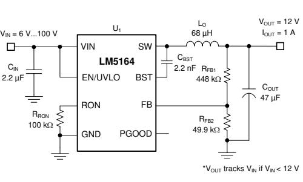

**Typical Application**

minimizing the need for external surge suppression components. A minimum controllable on-time of 50ns facilitates large step-down conversion ratios, enabling the direct step-down from a 48V nominal input to low-voltage rails for reduced system complexity and design cost. The LM5164 operates during input voltage dips as low as 6V, at nearly 100% duty cycle if needed, making the device an excellent choice for wide input supply range industrial and high cell count battery pack applications. With integrated high-side and low-side power

MOSFETs, the LM5164 delivers up to 1A of output current. A constant on-time (COT) control architecture provides nearly constant switching frequency with excellent load and line transient response. Additional features of the LM5164 include ultra-low IQ and diode emulation mode operation for high light-load efficiency, remarkable peak and valley overcurrent protection, integrated VCC bias supply and bootstrap diode, precision enable and input UVLO, and thermal shutdown protection with automatic recovery. An open-drain PGOOD indicator provides sequencing, fault reporting, and output voltage monitoring.The LM5164 is available in a thermally-enhanced, 8 pin SO PowerPAD integrated circuit package. The 1.27mm pin pitch provides adequate spacing for highvoltage applications.

The LM5164 is available in a thermally-enhanced, 8-pin SO PowerPAD integrated circuit package. The device 1.27mm pin pitch provides adequate spacing for high-voltage applications.

### **Package Information**

| PART NUMBER | PACKAGE(1)           | PACKAGE SIZE(2) |  |  |  |  |  |
|-------------|----------------------|-----------------|--|--|--|--|--|
| LM5164      | DDA (SO PowerPAD, 8) | 4.9mm × 6mm     |  |  |  |  |  |

- (1) For more information, see [Section 10.](#page-26-0)
- (2) The package size (length × width) is a nominal value and includes pins, where applicable.

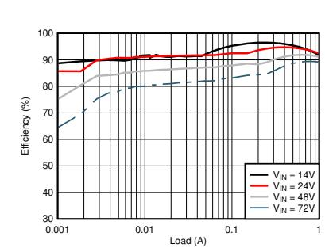

**Typical Efficiency, VOUT = 12V**

## **Table of Contents**

| 1 Features1                           | 7 Application and Implementation16                    |  |
|---------------------------------------|-------------------------------------------------------|--|
| 2 Applications1                       | 7.1 Application Information 16                        |  |
| 3 Description1                        | 7.2 Typical Application 16                            |  |
| 4 Pin Configuration and Functions3    | 7.3 Power Supply Recommendations23                    |  |
| 5 Specifications 4                    | 7.4 Layout 23                                         |  |
| 5.1 Absolute Maximum Ratings 4        | 8 Device and Documentation Support26                  |  |
| 5.2 ESD Ratings 4                     | 8.1 Device Support 26                                 |  |
| 5.3 Recommended Operating Conditions4 | 8.2 Documentation Support 26                          |  |
| 5.4 Thermal Information5              | 8.3 Receiving Notification of Documentation Updates27 |  |
| 5.5 Electrical Characteristics5       | 8.4 Support Resources 27                              |  |
| 5.6 Typical Characteristics7          | 8.5 Trademarks27                                      |  |
| 6 Detailed Description9               | 8.6 Electrostatic Discharge Caution27                 |  |
| 6.1 Overview9                         | 8.7 Glossary27                                        |  |
| 6.2 Functional Block Diagram10        | 9 Revision History 27                                 |  |
| 6.3 Feature Description10             | 10 Mechanical, Packaging, and Orderable               |  |
| 6.4 Device Functional Modes15         | Information 27                                        |  |
|                                       |                                                       |  |
|                                       |                                                       |  |

## **4 Pin Configuration and Functions**

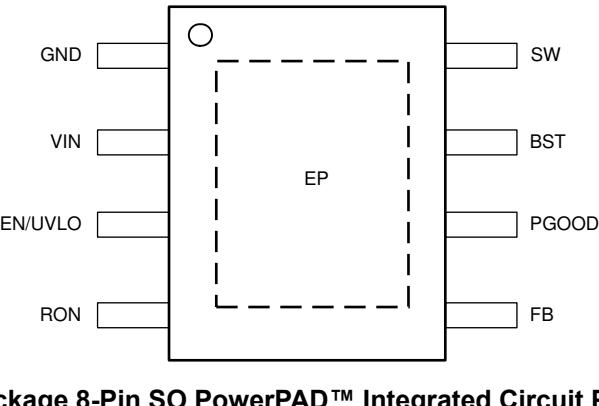

**Figure 4-1. DDA Package 8-Pin SO PowerPAD™ Integrated Circuit Package (Top View)**

|     | Table 4-1. Pin Functions |     |                                                                                                                                                                                                                                                                                                                                                                                                             |  |  |  |  |  |  |
|-----|--------------------------|-----|-------------------------------------------------------------------------------------------------------------------------------------------------------------------------------------------------------------------------------------------------------------------------------------------------------------------------------------------------------------------------------------------------------------|--|--|--|--|--|--|
|     | PIN TYPE(1)           |     |                                                                                                                                                                                                                                                                                                                                                                                                             |  |  |  |  |  |  |
| NO. | NAME                     |     | DESCRIPTION                                                                                                                                                                                                                                                                                                                                                                                                 |  |  |  |  |  |  |
| 1   | GND                      | G   | Ground connection for internal circuits                                                                                                                                                                                                                                                                                                                                                                     |  |  |  |  |  |  |
| 2   | VIN                      | P/I | Regulator supply input pin to high-side power MOSFET and internal bias regulator. Connect directly to the input supply of the buck converter with short, low impedance paths.                                                                                                                                                                                                                            |  |  |  |  |  |  |
| 3   | EN/UVLO                  | I   | Precision enable and undervoltage lockout (UVLO) programming pin. If the EN/UVLO voltage is below 1.1V, the converter is in shutdown mode with all functions disabled. If the UVLO voltage is greater than 1.1V and below 1.5V, the converter is in standby mode with the internal VCC regulator operational and no switching. If the EN/UVLO voltage is above 1.5V, the start-up sequence begins. |  |  |  |  |  |  |
| 4   | RON                      | I   | On-time programming pin. A resistor between this pin and GND sets the buck switch on-time.                                                                                                                                                                                                                                                                                                                  |  |  |  |  |  |  |
| 5   | FB                       | I   | Feedback input of voltage regulation comparator                                                                                                                                                                                                                                                                                                                                                             |  |  |  |  |  |  |
| 6   | PGOOD                    | O   | Power good indicator. This pin is an open-drain output pin. Connect to a source voltage through an external pullup resistor between 10kΩ to 100kΩ.                                                                                                                                                                                                                                                       |  |  |  |  |  |  |
| 7   | BST                      | P/I | Bootstrap gate-drive supply. Required to connect a high-quality 2.2nF 50V X7R ceramic capacitor between BST and SW to bias the internal high-side gate driver.                                                                                                                                                                                                                                           |  |  |  |  |  |  |
| 8   | SW                       | P   | Switching node that is internally connected to the source of the high-side NMOS buck switch and the drain of the low-side NMOS synchronous rectifier. Connect to the switching node of the power inductor.                                                                                                                                                                                            |  |  |  |  |  |  |
| —   | EP                       | —   | Exposed pad of the package. No internal electrical connection. Connect the EP to the GND pin and connect to a large copper plane to reduce thermal resistance.                                                                                                                                                                                                                                           |  |  |  |  |  |  |

Product Folder Links: *[LM5164](https://www.ti.com/product/lm5164?qgpn=lm5164)*

(1) G = Ground, I = Input, O = Output, P = Power

## **5 Specifications**

### **5.1 Absolute Maximum Ratings** Over the recommended operating junction temperature range of –40°C to +150°C (unless otherwise noted)(1)

|                           |                                    | MIN  | MAX   | UNIT |
|---------------------------|------------------------------------|------|-------|------|
|                           | VIN to GND                         | –0.3 | 100   |      |
|                           | EN to GND                          | –0.3 | 100   |      |
| Input voltage             | FB to GND                          | –0.3 | 5.5   | V    |
|                           | RON to GND                         | –0.3 | 5.5   |      |
| Bootstrap capacitor    | External BST to SW capacitance     | 1.5  | 2.5   | nF   |
|                           | BST to GND                         | –0.3 | 105.5 |      |
|                           | BST to SW                          | –0.3 | 5.5   |      |
| Output voltage            | SW to GND                          | –1.5 | 100   | V    |
|                           | SW to GND (20ns transient)         | –3   |       |      |
|                           | PGOOD to GND                       | –0.3 | 14    |      |
|                           | Operating junction temperature, TJ | –40  | 150   | °C   |
| Storage temperature, Tstg |                                    | –65  | 150   | °C   |

ratings only, which do not imply functional operation of the device at these or any other conditions beyond those indicated under Recommended Operating Conditions. Exposure to absolute-maximum-rated conditions for extended periods may affect device reliability.

### **5.2 ESD Ratings**

|        |  |                                                                                               | VALUE | UNIT |   |
|--------|--|-----------------------------------------------------------------------------------------------|-------|------|---|
|        |  | Human-body model (HBM), per ANSI/ESDA/JEDEC JS-001(1)                                         | ±2000 |      |   |
| V(ESD) |  | Electrostatic discharge Charged-device model (CDM), per JEDEC specification JESD22-C101(2) |       | ±500 | V |

- (1) JEDEC document JEP155 states that 500V HBM allows safe manufacturing with a standard ESD control process.
- (2) JEDEC document JEP157 states that 250V CDM allows safe manufacturing with a standard ESD control process.

### **5.3 Recommended Operating Conditions**

Over the recommended operating junction temperature range of –40°C to +150°C (unless otherwise noted)(1)

|          |                                | MIN | NOM | MAX   | UNIT |
|----------|--------------------------------|-----|-----|-------|------|
| VIN      | Input voltage                  | 6   |     | 100   | V    |
| VSW      | Switch node voltage            |     |     | 100   | V    |
| VEN/UVLO | Enable voltage                 |     |     | 100   | V    |
| ILOAD    | Load current                   |     | 1   | 1.25  | A    |
| FSW      | Switching frequency            |     |     | 1000  | kHz  |
| CBST     | External BST to SW capacitance |     | 2.2 |       | nF   |
| tON      | Programmable on-time           | 50  |     | 10000 | ns   |

4 *[Submit Document Feedback](https://www.ti.com/feedbackform/techdocfeedback?litnum=SNVSAU4D&partnum=LM5164)* Copyright © 2026 Texas Instruments Incorporated

## **5.4 Thermal Information**

|           |                                              | LM5164     |      |  |
|-----------|----------------------------------------------|------------|------|--|
|           | THERMAL METRIC(1)                            | DDA (SOIC) | UNIT |  |
|           |                                              | 8 PINS     |      |  |
| RθJA      | Junction-to-ambient thermal resistance       | 43.4       | °C/W |  |
| RθJC(top) | Junction-to-case (top) thermal resistance    | 59.5       | °C/W |  |
| RθJB      | Junction-to-board thermal resistance         | 16.1       | °C/W |  |
| ΨJT       | Junction-to-top characterization parameter   | 4.0        | °C/W |  |
| ΨJB       | Junction-to-board characterization parameter | 16.3       | °C/W |  |
| RθJC(bot) | Junction-to-case (bottom) thermal resistance | 3.9        | °C/W |  |

note.

## **5.5 Electrical Characteristics**

Typical values correspond to TJ = 25°C. Minimum and maximum limits apply over the full –40°C to 150°C junction temperature range unless otherwise indicated. VIN = 24V and VEN/UVLO = 2V unless otherwise stated.

|                      | PARAMETER                                     | TEST CONDITIONS         | MIN   | TYP   | MAX   | UNIT |
|----------------------|-----------------------------------------------|-------------------------|-------|-------|-------|------|
| SUPPLY CURRENT (VIN) |                                               |                         |       |       |       |      |
| IQ-SHUTDOWN          | VIN shutdown current                          | VEN = 0V                |       | 3     | 15    | µA   |
| IQ-SLEEP1            | VIN sleep current                             | VEN = 2.5V, VFB = 1.5V  |       | 10.5  | 25    | µA   |
| IQ-ACTIVE            | VIN active current                            | VEN = 2.5V              |       | 600   | 880   | µA   |
|                      | PRECISION ENABLE (EN/UVLO)                    |                         |       |       |       |      |
| VSD-RISING           | Shutdown threshold                            | VEN/UVLO rising         |       |       | 1.1   | V    |
| VSD-FALLING          | Shutdown threshold                            | VEN/UVLO falling        | 0.45  |       |       | V    |
| VEN-RISING           | Enable threshold                              | VEN/UVLO rising         | 1.45  | 1.5   | 1.55  | V    |
| VEN-FALLING          | Enable threshold                              | VEN/UVLO falling        | 1.35  | 1.4   | 1.44  | V    |
|                      | FEEDBACK VOLTAGE (FB)                         |                         |       |       |       |      |
| VREF                 | FB regulation voltage                         | VFB falling             | 1.181 | 1.2   | 1.218 | V    |
| TIMING (RON)         |                                               |                         |       |       |       |      |
| tON1                 | On-time1                                      | VVIN = 6V, RRON = 75kΩ  |       | 5000  |       | ns   |
| tON2                 | On-time2                                      | VVIN = 6V, RRON = 25kΩ  |       | 1650  |       | ns   |
| tON3                 | On-time3                                      | VVIN = 12V, RRON = 75kΩ |       | 2550  |       | ns   |
| tON4                 | On-time4                                      | VVIN = 12V, RRON = 25kΩ |       | 830   |       | ns   |
|                      | POWER GOOD MONITOR (PGOOD)                    |                         |       |       |       |      |
| VPG-UTH              | FB upper threshold for PGOOD high to low   | VFB rising              | 1.105 | 1.14  | 1.175 | V    |
| VPG-LTH              | FB lower threshold for PGOOD high to low   | VFB falling             | 1.055 | 1.08  | 1.1   | V    |
| VPG-HYS              | PGOOD upper and lower threshold hysteresis | VFB falling             |       | 60    |       | mV   |
| RPG                  | PGOOD pulldown resistance                     | VFB = 1V                |       | 30    |       | Ω    |
| BOOTSTRAP (BST)      |                                               |                         |       |       |       |      |
| VBST-UV              | Gate drive UVLO                               | VBST rising             |       | 2.7   | 3.4   | V    |
| POWER SWITCHES       |                                               |                         |       |       |       |      |
| RDSON-HS             | High-side MOSFET RDSON                        | ISW = –100mA            |       | 0.725 |       | Ω    |
| RDSON-LS             | Low-side MOSFET RDSON                         | ISW = 100mA             |       | 0.33  |       | Ω    |
|                      |                                               |                         |       |       |       |      |

Product Folder Links: *[LM5164](https://www.ti.com/product/lm5164?qgpn=lm5164)*

## **5.5 Electrical Characteristics (continued)**

Typical values correspond to TJ = 25°C. Minimum and maximum limits apply over the full –40°C to 150°C junction temperature range unless otherwise indicated. VIN = 24V and VEN/UVLO = 2V unless otherwise stated.

|               | PARAMETER                               | TEST CONDITIONS | MIN  | TYP | MAX  | UNIT |
|---------------|-----------------------------------------|-----------------|------|-----|------|------|
| SOFT START    |                                         |                 |      |     |      |      |
| tSS           | Internal soft-start time                |                 | 1.75 | 3   | 4.75 | ms   |
| CURRENT LIMIT |                                         |                 |      |     |      |      |
| IPEAK1        | Peak current limit threshold (HS)       |                 | 1.25 | 1.5 | 1.75 | A    |
| IPEAK2        | Peak current limit threshold (LS)       |                 | 1.25 | 1.5 | 1.75 | A    |
| IDELTA-ILIM   | Min of (IPEAK1 or IPEAK2) minus IVALLEY |                 | 200  | 300 |      | mA   |
| IVALLEY       | Valley current limit threshold          |                 | 0.95 | 1.2 | 1.4  | A    |
|               | THERMAL SHUTDOWN                        |                 |      |     |      |      |
| TSD           | Thermal shutdown threshold              | TJ rising    |      | 175 |      | °C   |
| TSD-HYS       | Thermal shutdown hysteresis             |                 |      | 10  |      | °C   |
|               |                                         |                 |      |     |      |      |
|               |                                         |                 |      |     |      |      |

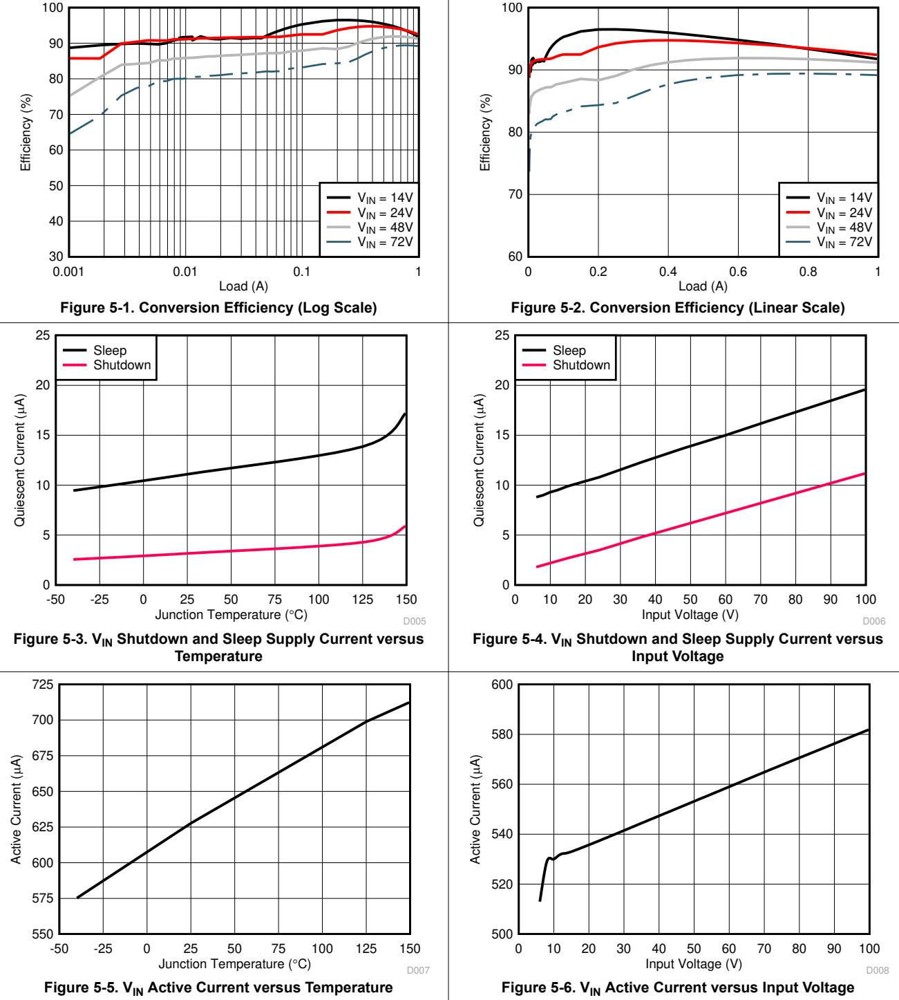

## **5.6 Typical Characteristics (continued)**

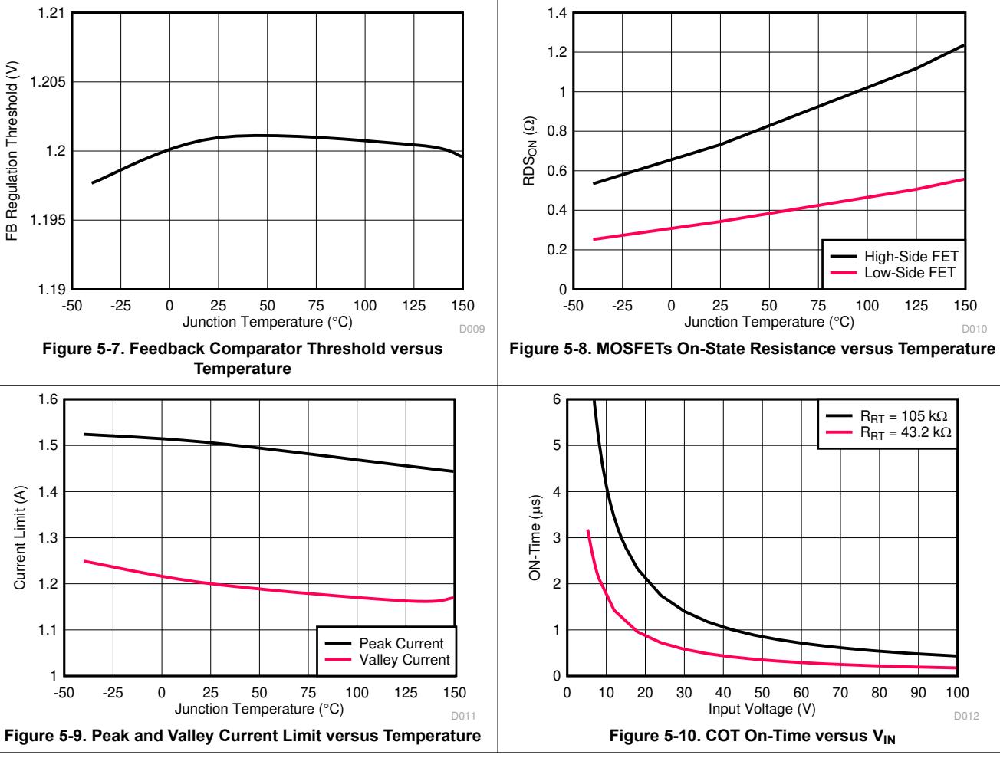

### **6 Detailed Description 6.1 Overview**

The LM5164 is an easy-to-use, ultra-low IQ constant on-time (COT) synchronous step-down buck regulator. With integrated high-side and low-side power MOSFETs, the LM5164 is a low-cost, highly efficient buck converter that operates from a wide input voltage of 6V to 100V, delivering up to 1A DC load current. The LM5164 is available in an 8-pin SO PowerPAD integrated circuit package with 1.27mm pin pitch for adequate spacing in high-voltage applications. This constant on-time (COT) converter is an excellent choice for low-noise, high-current, and fast load transient requirements, operating with a predictive on-time switching pulse. Over the input voltage range, input voltage feedforward is employed to achieve a quasi-fixed switching frequency. A controllable on-time as low as 50ns permits high step-down ratios and a minimum forced off-time of 50ns provides extremely high duty cycles, allowing VIN to drop close to VOUT before frequency foldback occurs. At light loads, the device transitions into an ultra-low IQ mode to maintain high efficiency and prevent draining battery cells connected to the input when the system is in standby. The LM5164 implements a smart peak and valley current limit detection circuit to ensure robust protection during output short circuit conditions. Control loop compensation is not required for this regulator, reducing design time and external component count. The LM5164 incorporates additional features for comprehensive system requirements, including an open-drain

power good circuit for the following:

- Power-rail sequencing and fault reporting
- Internally-fixed soft start of 3ms
- Monotonic start-up into prebiased loads
- Precision enable for programmable line undervoltage lockout (UVLO)
- Smart cycle-by-cycle current limit for optimal inductor sizing
- Thermal shutdown with automatic recovery

These features enable a flexible and easy-to-use platform for a wide range of applications. The LM5164 supports a wide range of end-equipment systems requiring a regulated output from a high input supply where the transient voltage deviates from the DC level. The following are examples of such end-equipment systems:

- 48V automotive systems
- High cell-count battery-pack systems
- 24V industrial systems
- 48V telecom and PoE voltage ranges

The pin arrangement is designed for a simple PCB layout requiring only a few external components.

## **6.2 Functional Block Diagram**

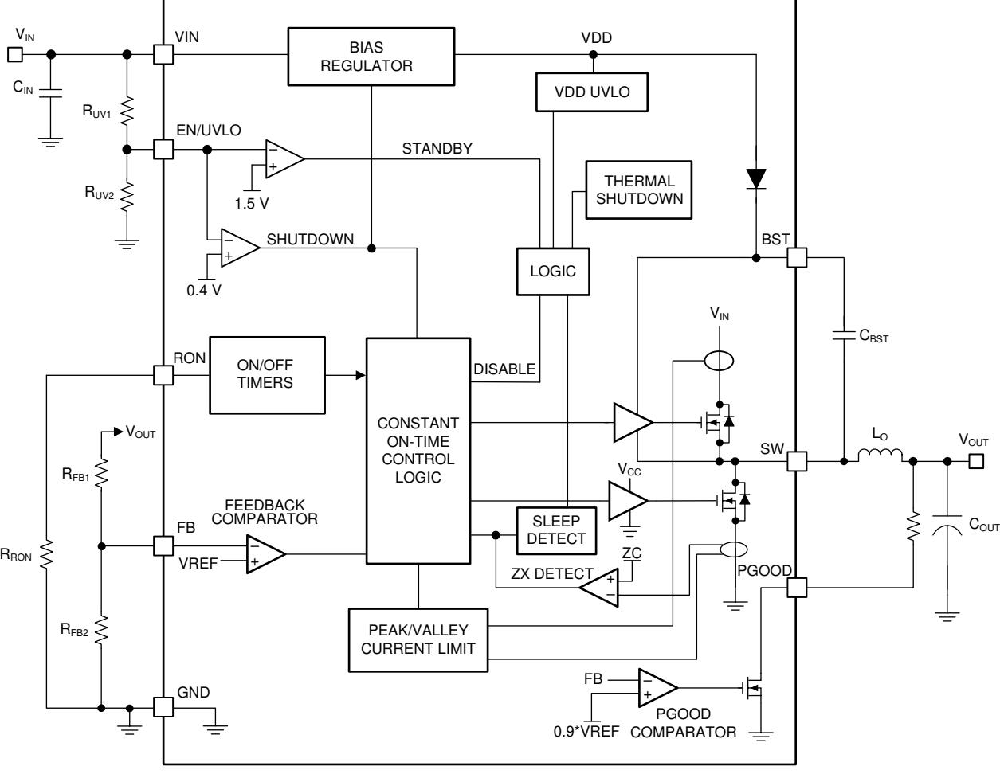

### **6.3 Feature Description**

### *6.3.1 Control Architecture*

The LM5164 buck switching converter employs a constant on-time (COT) control scheme. The COT control scheme sets a fixed on-time tON of the high-side FET using a timing resistor (RON). The tON is adjusted as input voltage changes and is inversely proportional to the input voltage to maintain a fixed frequency when in continuous conduction mode (CCM). After expiration of tON, the high-side FET remains off until the FB voltage is equal or below the reference voltage of 1.2V. To maintain stability, the feedback comparator requires a minimal ripple voltage that is in phase with the inductor current during the off-time. Furthermore, this change in FB voltage during the off-time must be large enough to dominate any noise present at the feedback node. The minimum recommended ripple voltage is 20mV. See [Table 6-1](#page-10-0) for ripple injection schemes that make sure of stability over the full input voltage range.

During a rapid start-up or a positive load step, the regulator operates with minimum off-times until regulation is achieved. This feature enables extremely fast load transient response with minimum output voltage undershoot. When regulating the output in steady-state operation, the off-time automatically adjusts itself to produce duty cycle required for output voltage regulation to maintain a fixed switching frequency. In CCM, the switching frequency FSW is programmed by the RRON resistor. Use Equation 1 to calculate the switching frequency.

$$F_{SW}(kHz) = \frac{V_{OUT}(V) \times 2500}{R_{RON}(k\Omega)}$$
 (1)

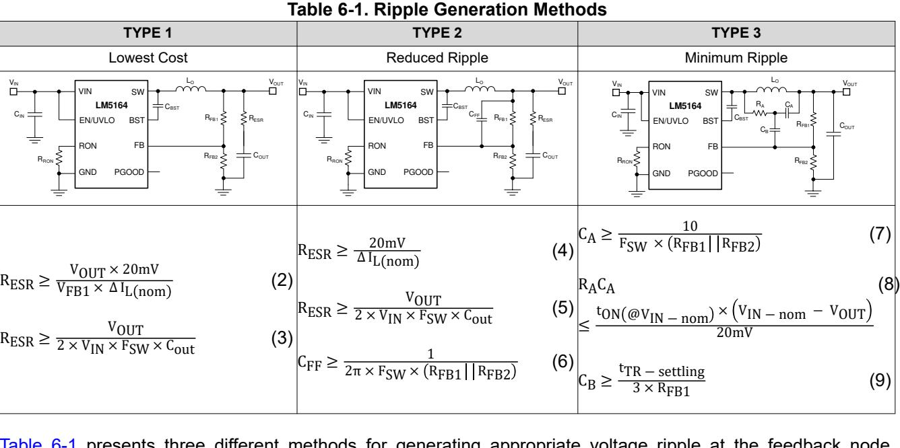

Table 6-1 presents three different methods for generating appropriate voltage ripple at the feedback node. Type-1 ripple generation method uses a single resistor, RESR, in series with the output capacitor. The generated voltage ripple has two components: capacitive ripple caused by the inductor ripple current charging and discharging the output capacitor and resistive ripple caused by the inductor ripple current flowing into the output capacitor and through series resistance RESR. The capacitive ripple component is out of phase with the inductor current and does not decrease monotonically during the off-time. The resistive ripple component is in phase with the inductor current and decreases monotonically during the off-time. The resistive ripple must exceed the capacitive ripple at VOUT for stable operation. If this condition is not satisfied, unstable switching behavior is observed in COT converters, with multiple on-time bursts in close succession followed by a long off-time. Equation 2 and Equation 3 define the value of the series resistance RESR to make sure of sufficient in-phase ripple at the feedback node.

Type-2 ripple generation uses a CFF capacitor in addition to the series resistor. As the output voltage ripple is directly AC-coupled by CFF to the feedback node, the RESR and ultimately the output voltage ripple are reduced by a factor of VOUT / VFB.

Type-3 ripple generation uses an RC network consisting of RA and CA, and the switch node voltage to generate a triangular ramp that is in-phase with the inductor current. This triangular wave is the AC-coupled into the feedback node with capacitor CB. Because this circuit does not use output voltage ripple, this circuit is designed for applications where low output voltage ripple is critical. The *[AN-1481 Controlling Output Ripple and Achieving](https://www.ti.com/lit/pdf/SNVA166) [ESR Independence in Constant On-time \(COT\) Regulator Designs](https://www.ti.com/lit/pdf/SNVA166)* application note provides additional details on this topic.

Diode emulation mode (DEM) prevents negative inductor current, and pulse skipping maintains the highest efficiency at light load by decreasing the effective switching frequency. DEM operation occurs when the synchronous power MOSFET switches off as inductor valley current reaches zero. Here, the load current is less than half of the peak-to-peak inductor current ripple in CCM. Turning off the low-side MOSFET at zero current reduces switching loss, and preventing negative current reduces circulating energy loss. Power conversion efficiency is higher in a DEM converter than an equivalent forced-PWM CCM converter. With DEM operation, the duration that both power MOSFETs remain off progressively increases as load current decreases. When this idle duration exceeds 15μs, the converter transitions into an ultra-low IQ mode, consuming only 10μA quiescent current from the input.

### *6.3.2 Internal VCC Regulator and Bootstrap Capacitor*

The LM5164 contains an internal VCC bias supply subregulator that is powered from VIN with a nominal output of 5V, eliminating the need for an external capacitor for stability. The internal VCC subregulator supplies current to internal circuit blocks including the MOSFET driver and logic circuits. The input pin (VIN) can be connected directly to line voltages up to 100V. As the high side power MOSFET has a low total gate charge, use a low bootstrap capacitor value to reduce the stress on the internal regulator. Selecting a high-quality 2.2nF 50V X7R ceramic bootstrap capacitor as specified in the *[Absolute Maximum Ratings](#page-3-0)* section is required. Selecting a higher value capacitance stresses the internal VCC regulator and damages the device. A lower capacitance than required is not sufficient to drive the internal gate of the power MOSFET. An internal diode connects from the VCC regulator to the BST pin to replenish the charge in the high-side gate drive bootstrap capacitor when the SW voltage is low. *6.3.3 Regulation Comparator*

The feedback voltage at FB is compared to an internal 1.2V Vref. The LM5164 voltage regulation loop regulates the output voltage by maintaining the FB voltage equal to VREF. A resistor divider programs the ratio from output voltage VOUT to FB.

For a target VOUT setpoint, use Equation 10 to calculate RFB2 based on the selected RFB1.

$$R_{FB2} = \frac{1.2V}{V_{OUT} - 1.2V} \times R_{FB1}$$
 (10)

TI recommends selecting RFB1 in the range of 100kΩ to 1MΩ for most applications. A larger RFB1 consumes less DC current, which is mandatory if light-load efficiency is critical. RFB1 larger than 1MΩ is not recommended as the feedback path becomes more susceptible to noise. Route the feedback trace away from the noisy area of the PCB and keep the feedback resistors close to the FB pin.

### *6.3.4 Internal Soft Start*

The LM5164 employs an internal soft-start control ramp that allows the output voltage to gradually reach a steady-state operating point, thereby reducing start-up stresses and current surges. The soft-start feature produces a controlled, monotonic output voltage start-up. The soft-start time is internally set to 3ms.

### *6.3.5 On-Time Generator*

The on-time of the LM5164 high-side MOSFET is determined by the RRON resistor and is inversely proportional to the input voltage, VIN. The inverse relationship with VIN results in a nearly constant frequency as VIN is varied. Use Equation 11 to calculate the on-time.

$$t_{ON}\left(\mu s\right) = \frac{R_{ON}(k\Omega)}{V_{IN}(V) \times 2.5} \tag{11}$$

Use Equaton 12 to determine the RRON resistor to set a specific switching frequency in CCM.

$$R_{RON}(k\Omega) = \frac{V_{OUT}(V) \times 2500}{F_{SW}(kHz)}$$
 (12)

Select RRON for a minimum on-time (at maximum VIN) greater than 50ns for proper operation. In addition to this minimum on-time, the maximum frequency for this device is limited to 1MHz.

### *6.3.6 Current Limit*

The LM5164 manages overcurrent conditions with cycle-by-cycle current limiting of the peak inductor current. The current sensed in the high-side MOSFET is compared every switching cycle to the current limit threshold (1.5A). To protect the converter from potential current runaway conditions, the LM5164 includes a foldback valley current limit feature, set at 1.2A, that is enabled if a peak current limit is detected. As shown in [Figure 6-1,](#page-12-0) if the peak current in the high-side MOSFET exceeds 1.5A (typical), the present cycle is immediately terminated regardless of the programmed on-time (tON), the high-side MOSFET is turned off and the foldback valley current limit is activated. The low-side MOSFET remains on until the inductor current drops below this foldback valley current limit, after which the next on-pulse is initiated. This method folds back the switching frequency to prevent

Product Folder Links: *[LM5164](https://www.ti.com/product/lm5164?qgpn=lm5164)*

12 *[Submit Document Feedback](https://www.ti.com/feedbackform/techdocfeedback?litnum=SNVSAU4D&partnum=LM5164)* Copyright © 2026 Texas Instruments Incorporated

t

overheating and limits the average output current to less than 1.5A to ensure proper short-circuit and heavy-load protection of the LM5164.

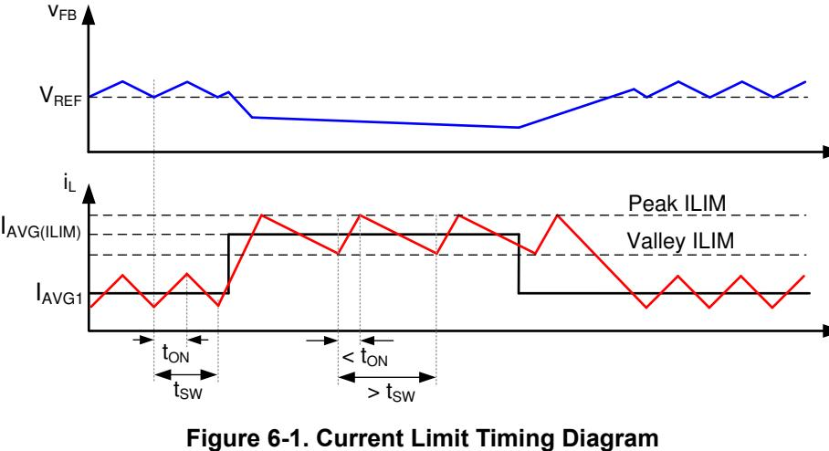

Current is sensed after a leading-edge blanking time following the high-side MOSFET turn-on transition. The propagation delay of the current limit comparator is 100ns. During high step-down conditions when the on-time is less than 100ns, a back-up peak current limit comparator in the low-side FET also set at 1.5A enables the foldback valley current limit set at 1.2A. This remarkable current limit scheme enables ultra-low duty-cycle operation, permitting large step-down voltage conversions while ensuring robust protection of the converter.

### *6.3.7 N-Channel Buck Switch and Driver*

The LM5164 integrates an N-channel buck switch and associated floating high-side gate driver. The gate-driver circuit works in conjunction with an external bootstrap capacitor and an internal high-voltage bootstrap diode. A high-quality 2.2nF, 50V X7R ceramic capacitor connected between the BST and SW pins provides the voltage to the high-side driver during the buck switch on-time. See the *[Internal VCC Regulator and Bootstrap Capacitor](#page-10-0)*  section for limitations. During the off-time, the SW pin is pulled down to approximately 0V, and the bootstrap capacitor charges from the internal VCC through the internal bootstrap diode. The minimum off-timer, set to 50ns (typical), ensures a minimum time each cycle to recharge the bootstrap capacitor. When the on-time is less than 300ns, the minimum off-timer is forced to 250ns to ensure that the BST capacitor is charged in a single cycle. This is vital during wake up from sleep mode when the BST capacitor is most likely discharged.

### *6.3.8 Synchronous Rectifier*

The LM5164 provides an internal low-side synchronous rectifier N-channel MOSFET. This MOSFET provides a low-resistance path for the inductor current to flow when the high-side MOSFET is turned off.

The synchronous rectifier operates in a diode emulation mode. Diode emulation enables the regulator to operate in a pulse-skipping mode during light-load conditions. This mode leads to a reduction in the average switching frequency at light loads. MOSFET switching and gate driver losses, both of which are proportional to switching frequency, are significantly reduced at very light loads and efficiency is improved. This pulse-skipping mode also reduces the circulating inductor current and losses associated with conventional CCM at light loads.

### *6.3.9 Enable/Undervoltage Lockout (EN/UVLO)*

The LM5164 contains a dual-level EN/UVLO circuit. When the EN/UVLO voltage is below 1.1V (typical), the converter is in a low-current shutdown mode and the input quiescent current (IQ) is dropped down to 3µA. When the voltage is greater than 1.1V but less than 1.5V (typical), the converter is in standby mode. In standby mode, the internal bias regulator is active while the control circuit is disabled. When the voltage exceeds the rising threshold of 1.5V (typical), normal operation begins. Install a resistor divider from VIN to GND to set the minimum operating voltage of the regulator. Use [Equation 13](#page-13-0) and [Equation 14](#page-13-0) to calculate the input UVLO turn-on and turn-off voltages, respectively.

$$V_{\rm IN(on)} = 1.5V \times \left(1 + \frac{R_{\rm UV1}}{R_{\rm UV2}}\right) \tag{13}$$

$$V_{\rm IN(off)} = 1.4V \times \left(1 + \frac{R_{\rm UV1}}{R_{\rm UV2}}\right) \tag{14}$$

TI recommends selecting RUV1 in the range of 1 MΩ for most applications. A larger RUV1 consumes less DC current, which is mandatory if light-load efficiency is critical. If input UVLO is not required, the power-supply designer can either drive EN/UVLO as an enable input driven by a logic signal or connect directly to VIN. If EN/UVLO is directly connected to VIN, the regulator begins switching as soon as the internal bias rails are active. *6.3.10 Power Good (PGOOD)*

The LM5164 provides a PGOOD flag pin to indicate when the output voltage is within the regulation level. Use the PGOOD signal for start-up sequencing of downstream converters or for fault protection and output monitoring. PGOOD is an open-drain output that requires a pullup resistor to a DC supply not greater than 14V. The typical range of pullup resistance is 10kΩ to 100kΩ. If necessary, use a resistor divider to decrease the voltage from a higher voltage pullup rail. When the FB voltage exceeds 95% of the internal reference VREF, the internal PGOOD switch turns off and PGOOD can be pulled high by the external pullup. If the FB voltage falls below 90% of VREF, an internal 25Ω PGOOD switch turns on and PGOOD is pulled low to indicate that the output voltage is out of regulation. The rising edge of PGOOD has a built-in deglitch delay of 5µs.

### *6.3.11 Thermal Protection*

The LM5164 includes an internal junction temperature monitor to protect the device in the event of a higher than normal junction temperature. If the junction temperature exceeds 175°C (typical), thermal shutdown occurs to prevent further power dissipation and temperature rise. The LM5164 initiates a restart sequence when the junction temperature falls to 165°C, based on a typical thermal shutdown hysteresis of 10°C. This is a non-latching protection, so the device cycles into and out of thermal shutdown if the fault persists.

14 *[Submit Document Feedback](https://www.ti.com/feedbackform/techdocfeedback?litnum=SNVSAU4D&partnum=LM5164)* Copyright © 2026 Texas Instruments Incorporated

### **6.4 Device Functional Modes** *6.4.1 Shutdown Mode*

EN/UVLO provides ON and OFF control for the LM5164. When VEN/UVLO is below approximately 1.1V, the device is in shutdown mode. Both the internal linear regulator and the switching regulator are off. The quiescent current in shutdown mode drops to 3µA at VIN = 24V. The LM5164 also employs internal bias rail undervoltage protection. If the internal bias supply voltage is below the UV threshold, the regulator remains off. *6.4.2 Active Mode*

The LM5164 is in active mode when VEN/UVLO is above the precision enable threshold and the internal bias rail is above the UV threshold. In COT active mode, the LM5164 is in one of three modes depending on the load current:

- 1. CCM with fixed switching frequency when load current is above half of the peak-to-peak inductor current ripple 2. Pulse skipping and diode emulation mode (DEM) when the load current is less than half of the peak-to-peak
- inductor current ripple in CCM operation 3. Current limit CCM with peak and valley current limit protection when an overcurrent condition is applied at
  - the output

## *6.4.3 Sleep Mode*

The *[Control Architecture](#page-9-0)* section gives a brief introduction to the LM5164 diode emulation (DEM) feature. The converter enters DEM during light-load conditions when the inductor current decays to zero and the synchronous MOSFET is turned off to prevent negative current in the system. In the DEM state, the load current is lower than half of the peak-to-peak inductor current ripple and the switching frequency decreases when the load is further decreased as the device operates in a pulse skipping mode. A switching pulse is set when VFB drops below 1.2V.

As the frequency of operation decreases and VFB remains above 1.2V (VREF) with the output capacitor sourcing the load current for greater than 15µs, the converter enters an ultra-low IQ sleep mode to prevent draining the input power supply. The input quiescent current (IQ) required by the LM5164 decreases to 10.5µA in sleep mode, improving the light-load efficiency of the regulator. In this mode, all internal controller circuits are turned off to ensure very low current consumption by the device. Such low IQ renders the LM5164 as the best option to extend operating lifetime for off-battery applications. The FB comparator and internal bias rail are active to detect when the FB voltage drops below the internal reference VREF and the converter transitions out of sleep mode into active mode. There is a 9µs wake-up delay from sleep to active states.

## **7 Application and Implementation**

## **Note**

Information in the following applications sections is not part of the TI component specification, and TI does not warrant its accuracy or completeness. TI's customers are responsible for determining suitability of components for their purposes, as well as validating and testing their design implementation to confirm system functionality.

## **7.1 Application Information**

The LM5164 requires only a few external components to step down from a wide range of supply voltages to a fixed output voltage. Several features are integrated to meet system design requirements, including the following:

- Precision enable • Input voltage UVLO
- Internal soft start
- Programmable switching frequency • A PGOOD indicator

To expedite and streamline the process of designing of a LM5164-based converter, a comprehensive LM5164 [quickstart calculator](http://www.ti.com/tool/lm5163-lm5164design-calc) is available for download to assist the designer with component selection for a given application. This tool is complemented by the availability of an [evaluation module \(EVM\),](http://www.ti.com/tool/LM5164-Q1EVM) numerous PSPICE models, as well as TI's [WEBENCH® Power Designer](http://webench.ti.com/wb5/WBTablet/PartDesigner/quickview.jsp?base_pn=LM5164).

### **7.2 Typical Application**

Figure 7-1 shows the schematic for a 12V, 1A COT converter.

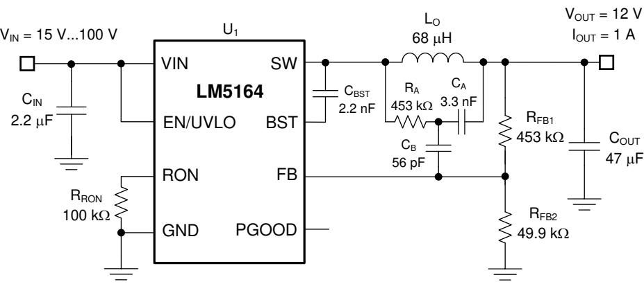

**Figure 7-1. Typical Application VIN(nom) = 48V, VOUT = 12V, IOUT(max) = 1A, FSW(nom) = 300kHz**

### **Note**

This and subsequent design examples are provided herein to showcase the LM5164 converter in several different applications. Depending on the source impedance of the input supply bus, an electrolytic capacitor can be required at the input to ensure stability, particularly at low input voltage and high output current operating conditions. See the *[Power Supply Recommendations](#page-22-0)* section for more details.

### *7.2.1 Design Requirements*

The target full-load efficiency is 92% based on a nominal input voltage of 48V and an output voltage of 12V. The required input voltage range is 15V to 100V. The LM5164 delivers a fixed 12V output voltage. The switching

Product Folder Links: *[LM5164](https://www.ti.com/product/lm5164?qgpn=lm5164)*

frequency is set by resistor RRON at 300kHz. The output voltage soft-start time is 3ms. Table 7-1 lists the required components. See also the *[LM5164-Q1 EVM User's Guide](https://www.ti.com/lit/pdf/SNVU620)*. **Table 7-1. List of Components**

| COUNT | REF DES | VALUE  | DESCRIPTION                               | PART NUMBER          | MANUFACTURER  |
|-------|---------|--------|-------------------------------------------|----------------------|---------------|
| 2     | CIN     | 2.2µF  | Capacitor, Ceramic, 2.2µF, 100V, X7R, 10% | CGA6N3X7R2A225K230AB | TDK           |
| 2     | COUT    | 22µF   | Capacitor, Ceramic, 22µF, 25V, X7R, 10%   | TMK325B7226KMHT      | Taiyo Yuden   |
| 1     | CA      | 3300pF | Capacitor, Ceramic, 3300pF, 16V, X7R, 10% | CGA3E2X7R2A332K080AA | TDK           |
| 1     | CB      | 56pF   | Capacitor, Ceramic, 56pF, 50V, X7R, 10%   | C0603C560J5GACTU     | Kemet         |
| 1     | CBST    | 2.2nF  | Capacitor, Ceramic, 2200pF, 50V, X7R, 10% | GCM155R71H222KA37D   | MuRata        |
| 1     | LO      | 68µH   | Inductor, 68µH, 170mΩ, > 1.8 A            | MSS1246T-683MLB      | Coilcraft     |
| 1     | RRON    | 100kΩ  | Resistor, Chip, 100k, 1%, 0.1 W, 0603     | RG1608P-1053-B-T5    | Susumu Co Ltd |
| 1     | RFB1    | 453kΩ  | Resistor, Chip, 453k, 1%, 0.1 W, 0603     | RT0603BRD07448KL     | Yageo         |
| 1     | RFB2    | 49.9kΩ | Resistor, Chip, 49.9k, 1%, 0.1 W, 0603    | RG1608P-4992-B-T5    | Susumu Co Ltd |
| 1     | RA      | 453kΩ  | Resistor, Chip, 453k, 1%, 0.1W, 0603      | RT0603BRD07453KL     | Yageo         |
| 1     | U1      |        | Wide VIN synchronous buck converter       | LM5164DDAR           | TI            |

### **7.2.2.1 Custom Design With WEBENCH® Tools**

[Click here](https://webench.ti.com/wb5/WBTablet/PartDesigner/quickview.jsp?base_pn=LM5164&origin=ODS&litsection=application) to create a custom design using the LM5164 device with the WEBENCH® Power Designer.

- 1. Start by entering the input voltage (VIN), output voltage (VOUT), and output current (IOUT) requirements.
- 2. Optimize the design for key parameters such as efficiency, footprint, and cost using the optimizer dial.
- 3. Compare the generated design with other possible solutions from Texas Instruments.

The WEBENCH Power Designer provides a customized schematic along with a list of materials with real-time pricing and component availability.

In most cases, these actions are available:

- Run electrical simulations to see important waveforms and circuit performance
- Run thermal simulations to understand board thermal performance
- Export customized schematic and layout into popular CAD formats
- Print PDF reports for the design, and share the design with colleagues

Get more information about WEBENCH tools at [www.ti.com/WEBENCH.](http://www.ti.com/lsds/ti/analog/webench/overview.page?DCMP=sva_web_webdesigncntr_en&HQS=sva-web-webdesigncntr-vanity-lp-en)

### **7.2.2.2 Switching Frequency (RRON)**

The switching frequency of the LM5164 is set by the on-time programming resistor placed at RON. As shown by Equation 15, a standard 100kΩ, 1% resistor sets the switching frequency at 300kHz.

$$R_{RON}(k\Omega) = \frac{V_{OUT}(V) \times 2500}{F_{SW}(kHz)}$$
 (15)

Note that at very low duty cycles, the 50ns minimum controllable on-time of the high-side MOSFET, tON(min), limits the maximum switching frequency. In CCM, tON(min) limits the voltage conversion step-down ratio for a given switching frequency. Use Equation 16 to calculate the minimum controllable duty cycle.

$$D_{MIN} = t_{ON(min)} \times F_{SW}$$
 (16)

Ultimately, the choice of switching frequency for a given output voltage affects the available input voltage range, design size, and efficiency. Use Equation 17 to calculate the maximum supply voltage for a given tON(min) before switching frequency reduction occurs.

$$V_{IN(max)} = \frac{V_{OUT}}{t_{ON(min)} \times F_{sw}}$$

Product Folder Links: *[LM5164](https://www.ti.com/product/lm5164?qgpn=lm5164)*

(17)

## **7.2.2.3 Buck Inductor (LO)**

Use Equation 18 and Equation 19 to calculate the inductor ripple current (assuming CCM operation) and peak inductor current, respectively.

$$\Delta I_{L} = \frac{V_{OUT}}{F_{SW} \times L_{O}} \times \left(1 - \frac{V_{OUT}}{V_{IN}}\right) \tag{18}$$

$$I_{L(peak)} = I_{OUT(max)} + \frac{\Delta I_L}{2}$$
(19)

For most applications, choose an inductance such that the inductor ripple current, ΔIL, is between 30% and 50% of the rated load current at nominal input voltage. Use Equation 20 to calculate the inductance.

$$L_{O} = \frac{V_{OUT}}{F_{SW} \times \Delta I_{L}} \times \left(1 - \frac{V_{OUT}}{V_{IN(nom)}}\right)$$
 (20)

Choosing a 68 μH inductor in this design results in 447 mA peak-to-peak ripple current at a nominal input voltage of 48 V, equivalent to 45% of the 1 A rated load current.

Check the inductor data sheet to make sure the saturation current of the inductor is well above the current limit setting of the LM5164. Ferrite-core inductors have relatively lower core losses and are preferred at high switching frequencies, but exhibit a hard saturation characteristic – the inductance collapses abruptly when the saturation current is exceeded. This results in an abrupt increase in inductor ripple current, higher output voltage ripple, and reduced efficiency, in turn compromising reliability. Note that inductor saturation current levels generally decrease as the core temperature increases. Meanwhile, powdered-iron inductors provide a soft saturation characterize where inductance gradually decreases with current.

### **7.2.2.4 Output Capacitor (COUT)**

Select a ceramic output capacitor to limit the capacitive voltage ripple at the converter output. This is the sinusoidal ripple voltage that is generated from the triangular inductor current ripple flowing into and out of the capacitor. Select an output capacitance using Equation 21 to limit the voltage ripple component to 0.5% of the output voltage.

$$C_{OUT} = \frac{\Delta I_L}{8 \times F_{SW} \times V_{OUT(ripple)}}$$
 (21)

Substituting ΔIL(nom) of 447mA gives COUT greater than 3μF. With voltage coefficients of ceramic capacitors taken in consideration, a 22µF, 25V rated capacitor with X7R dielectric is selected.

### **7.2.2.5 Input Capacitor (CIN)**

An input capacitor is necessary to limit the input ripple voltage while providing AC current to the buck power stage at every switching cycle. To minimize the parasitic inductance in the switching loop, position the input capacitors as close as possible to the VIN and GND pins of the LM5164. The input capacitors conduct a squarewave current of peak-to-peak amplitude equal to the output current. Following, that the resultant capacitive component of AC ripple voltage is a triangular waveform.

Along with the ESR-related ripple component, use Equation 22 to calculate the peak-to-peak ripple voltage amplitude.

$$V_{IN(ripple)} = \frac{I_{OUT} \times D \times (1 - D)}{C_{IN} \times F_{SW}} + I_{OUT} \times R_{ESR}$$
(22)

Use Equation 23 to calculate the input capacitance required for a load current, based on an input voltage ripple specification (ΔVIN).

$$C_{IN} \ge \frac{I_{OUT} \times D \times (1 - D)}{F_{SW} \times (V_{IN(ripple)} - (I_{OUT} \times R_{ESR})}$$

Product Folder Links: *[LM5164](https://www.ti.com/product/lm5164?qgpn=lm5164)*

(23)

The recommended high-frequency input capacitance is 2.2µF or higher. Make sure the input capacitor is a high-quality X7S or X7R ceramic capacitor with sufficient voltage rating for CIN. Based on the voltage coefficient of ceramic capacitors, choose a voltage rating of twice the maximum input voltage. Additionally, some bulk capacitance is required if the LM5164 is not located within approximately 5cm from the input voltage source. This capacitor provides parallel damping to the resonance associated with parasitic inductance of the supply lines and high-Q ceramics. See also the *[Power Supply Recommendations](#page-22-0)* section. **7.2.2.6 Type-3 Ripple Network**

A Type-3 ripple generation network uses an RC filter consisting of RA and CA across SW and VOUT to generate a triangular ramp that is in phase with the inductor current. This triangular ramp is then AC-coupled into the feedback node using capacitor CB as shown in [Figure 7-1](#page-15-0). Type-3 ripple injection is designed for applications where low output voltage ripple is crucial. Use Equation 24 and Equation 25 to calculate RA and CA to provide the required ripple amplitude at the FB pin.

$$C_{A} \ge \frac{10}{F_{SW} \times (R_{FB1} | |R_{FB2})}$$
 (24)

For the feedback resistor values given in [Figure 7-1,](#page-15-0) Equation 24 dictates a minimum CA of 742pF. In this design, a 3300 pF capacitance is chosen. This is done to keep RA within practical limits between 100kΩ and 1MΩ when using Equation 25.

$$R_{A}C_{A} \le \frac{t_{ON(nom)} \times \left(V_{IN-nom} - V_{OUT}\right)}{20mV} \tag{25}$$

Based on CA set at 3.3nF, RA is calculated to be 453kΩ to provide a 20mV ripple voltage at FB. The general recommendation for a Type-3 network is to calculate RA and CA to get 20mV of ripple at typical operating conditions, while ensuring a 12mV minimum ripple voltage on FB at minimum VIN.

While the amplitude of the generated ripple does not affect the output voltage ripple, the amplitude of the generated ripple impacts the output regulation as it reflects as a DC error of approximately half the amplitude of the generated ripple. For example, a converter circuit with Type-3 network that generates a 40mV ripple voltage at the feedback node has approximately 10mV worse load regulation scaled up through the FB divider to VOUT than the same circuit that generates a 20mV ripple at FB. Use Equation 26 to calculate the coupling capacitance CB.

$$C_{B} \ge \frac{t_{TR} - \text{settling}}{3 \times R_{FB1}} \tag{26}$$

### where

• tTR-settling is the desired load transient response settling time

CB calculates to 56pF based on a 75µs settling time. This value avoids excessive coupling capacitor discharge by the feedback resistors during sleep intervals when operating at light loads. To avoid capacitance fall-off with DC bias, use a C0G or NP0 dielectric capacitor for CB.

## *7.2.3 Application Curves*

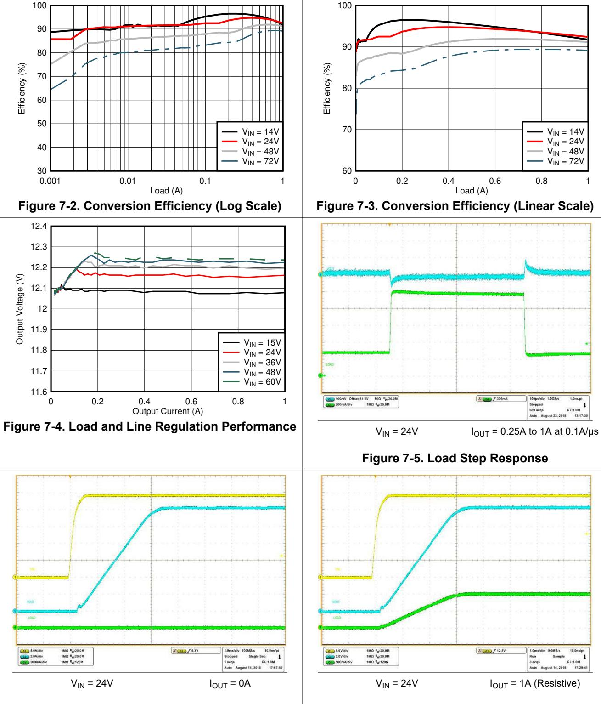

**Figure 7-6. No-Load Start-up with VIN**

**Figure 7-7. Full-Load Start-up with VIN**

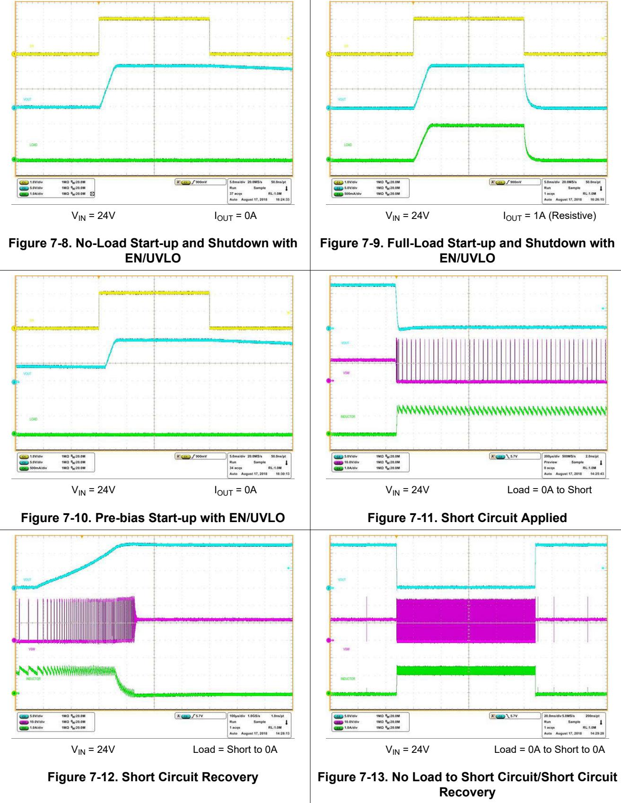

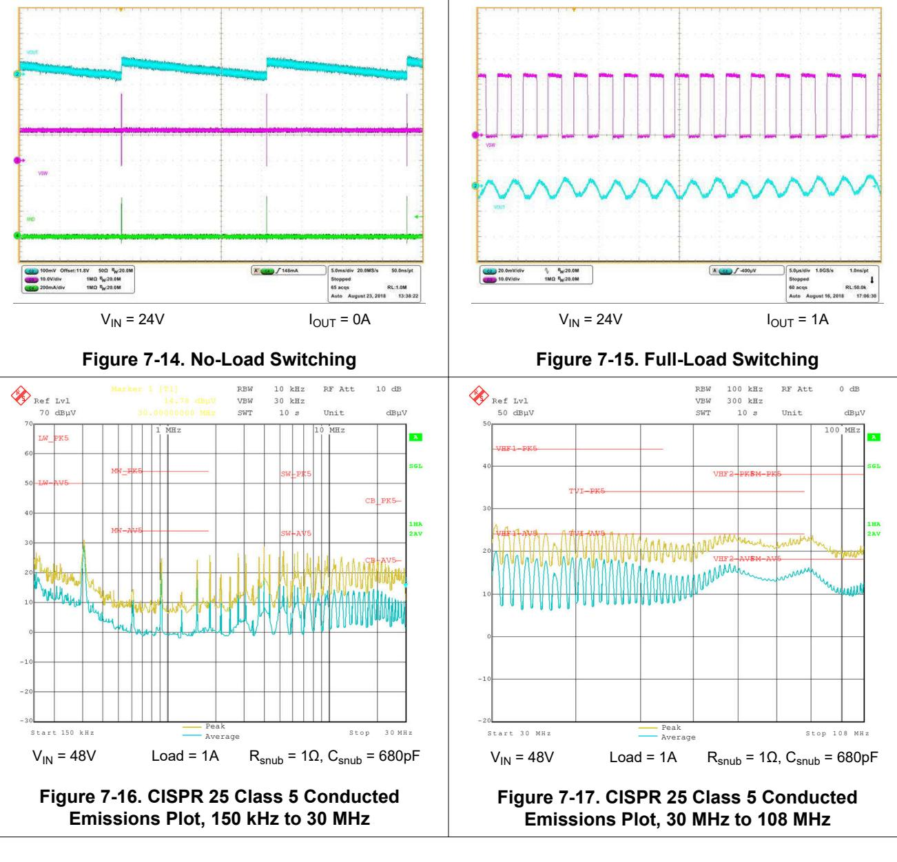

## **7.3 Power Supply Recommendations**

The LM5164 buck converter is designed to operate from a wide input voltage range between 6V and 100 V. The characteristics of the input supply must be compatible with the [Section 5.1](#page-3-0) and [Section 5.3](#page-3-0) tables. In addition, the input supply must be capable of delivering the required input current to the fully-loaded regulator. Use Equation 27 to estimate the average input current.

$$I_{\rm IN} = \frac{V_{\rm OUT} \times I_{\rm OUT}}{V_{\rm IN} \times \eta} \tag{27}$$

where

## • η is the efficiency

I

If the converter is connected to an input supply through long wires or PCB traces with a large impedance, take special care to achieve stable performance. The parasitic inductance and resistance of the input cables can have an adverse affect on converter operation. The parasitic inductance in combination with the low-ESR ceramic input capacitors form an underdamped resonant circuit. This circuit can cause overvoltage transients at VIN each time the input supply is cycled ON and OFF. The parasitic resistance causes the input voltage to dip during a load transient. If the converter is operating close to the minimum input voltage, this dip can cause false UVLO fault triggering and a system reset. The best way to solve such issues is to reduce the distance from the input supply to the regulator and use an aluminum electrolytic input capacitor in parallel with the ceramics. The moderate ESR of the electrolytic capacitor helps to damp the input resonant circuit and reduce any voltage overshoots. A 10μF electrolytic capacitor with a typical ESR of 0.5Ω provides enough damping for most input circuit configurations.

An EMI input filter is often used in front of the regulator that, unless carefully designed, can lead to instability as well as some of the effects mentioned above. The *[Simple Success with Conducted EMI for DC-DC Converters](https://www.ti.com/lit/pdf/SNVA489)*  [application note](https://www.ti.com/lit/pdf/SNVA489) provides helpful suggestions when designing an input filter for any switching regulator.

### **7.4 Layout**

### *7.4.1 Layout Guidelines*

PCB layout is a critical portion of good power supply design. There are several paths that conduct high slew-rate currents or voltages that can interact with stray inductance or parasitic capacitance to generate noise and EMI or degrade the power supply performance.

- 1. To help eliminate these problems, bypass the VIN pin to GND with a low-ESR ceramic capacitor with a high-quality dielectric. Place CIN as close as possible to the LM5164 VIN and GND pins. Grounding for both the input and output capacitors must consist of localized top-side planes that connect to the GND pin and GND PAD.
- 2. Minimize the loop area formed by the input capacitor connections to the VIN and GND pins.
- 3. Locate the inductor close to the SW pin. Minimize the area of the SW trace or plane to prevent excessive capacitive coupling.
- 4. Tie the GND pin directly to the power pad under the device and to a heat-sinking PCB ground plane.
- 5. Use a ground plane in layer 2 (below the power stage) one of the middle layers as a noise shielding and heat dissipation path.
- 6. Have a single-point ground connection to the plane. Route the ground connections for the feedback, RON, and enable components to the ground plane. This prevents any switched or load currents from flowing in analog ground traces. If not properly handled, poor grounding results in degraded load regulation or erratic output voltage ripple behavior.
- 7. Make VIN, VOUT and ground bus connections as wide as possible. This reduces any voltage drops on the input or output paths of the converter and maximizes efficiency.
- 8. Minimize trace length to the FB pin. Place both feedback resistors, RFB1 and RFB2, close to the FB pin. Place CFF (if needed) directly in parallel with RFB1. If output setpoint accuracy at the load is important, connect the VOUT sense at the load. Route the VOUT sense path away from noisy nodes and preferably through a layer on the other side of a grounded shielding layer.

- 9. The RON pin is sensitive to noise. Thus, locate the RRON resistor as close as possible to the device and route with minimal lengths of trace. The parasitic capacitance from RON to GND must not exceed 20 pF. 10. Provide adequate heat sinking for the LM5164 to keep the junction temperature below 150°C. For operation
- at full rated load, the top-side ground plane is an important heat-dissipating area. Use an array of heatsinking vias to connect the exposed pad to the PCB ground plane. If the PCB has multiple copper layers, these thermal vias must also be connected to inner layer heat-spreading ground planes. **7.4.1.1 Compact PCB Layout for EMI Reduction**

Radiated EMI generated by high di/dt components relates to pulsing currents in switching converters. The larger the area covered by the path of a pulsing current, the more electromagnetic emission is generated. The key to minimizing radiated EMI is to identify the pulsing current path and minimize the area of that path.

Figure 7-18 denotes the critical switching loop of the buck converter power stage in terms of EMI. The topological architecture of a buck converter means that a particularly high di/dt current path exists in the loop comprising the input capacitor and the integrated MOSFETs of the LM5164, and reducing the parasitic inductance of this loop by minimizing the effective loop area becomes mandatory.

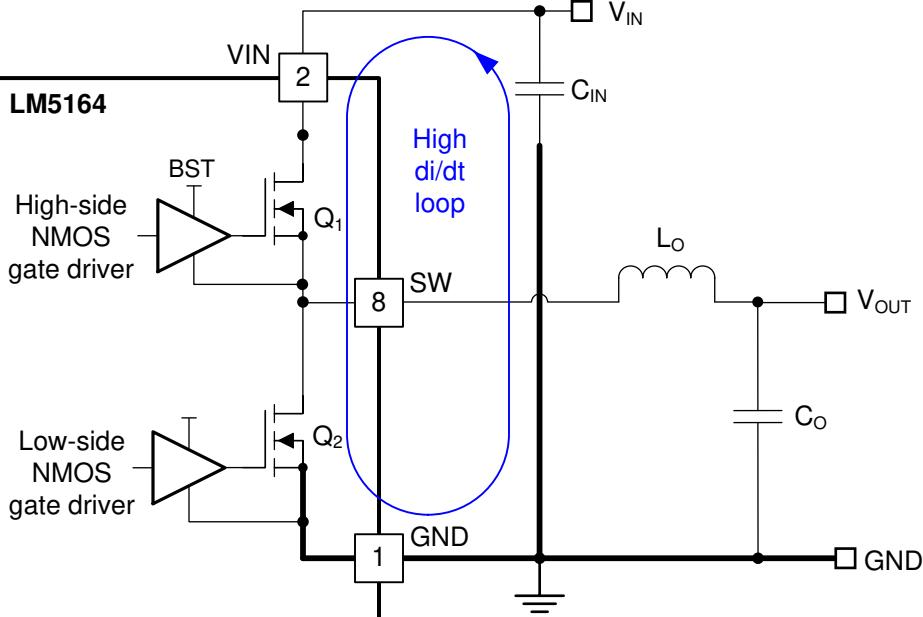

**Figure 7-18. DC/DC Buck Converter With Power Stage Circuit Switching Loop**

The input capacitor provides the primary path for the high di/dt components of the current of the high-side MOSFET. Placing a ceramic capacitor as close as possible to the VIN and GND pins is the key to EMI reduction. Keep the trace connecting SW to the inductor as short as possible and just wide enough to carry the load current without excessive heating. Use short, thick traces or copper pours (shapes) for current conduction path to minimize parasitic resistance. Place the output capacitor close to the VOUT side of the inductor, and connect the return terminal of the capacitor to the GND pin and exposed PAD of the LM5164.

### **7.4.1.2 Feedback Resistors**

Reduce noise sensitivity of the output voltage feedback path by placing the resistor divider close to the FB pin, rather than close to the load. This reduces the trace length of FB signal and noise coupling. The FB pin is the input to the feedback comparator, and as such, is a high impedance node sensitive to noise. The output node is a low impedance node, so the trace from VOUT to the resistor divider can be long if a short path is not available.

Route the voltage sense trace from the load to the feedback resistor divider, keeping away from the SW node, the inductor, and VIN to avoid contaminating the feedback signal with switch noise, while also minimizing the

24 *[Submit Document Feedback](https://www.ti.com/feedbackform/techdocfeedback?litnum=SNVSAU4D&partnum=LM5164)* Copyright © 2026 Texas Instruments Incorporated

trace length. This is most important when high feedback resistances greater than 100kΩ are used to set the output voltage. Also, route the voltage sense trace on a different layer from the inductor, SW node, and VIN so there is a ground plane that separates the feedback trace from the inductor and SW node copper polygon. This provides further shielding for the voltage feedback path from switching noise sources. *7.4.2 Layout Example*

Figure 7-19 shows an example layout for the PCB top layer of a 2-layer board with essential components placed on the top side. Type 3 ripple

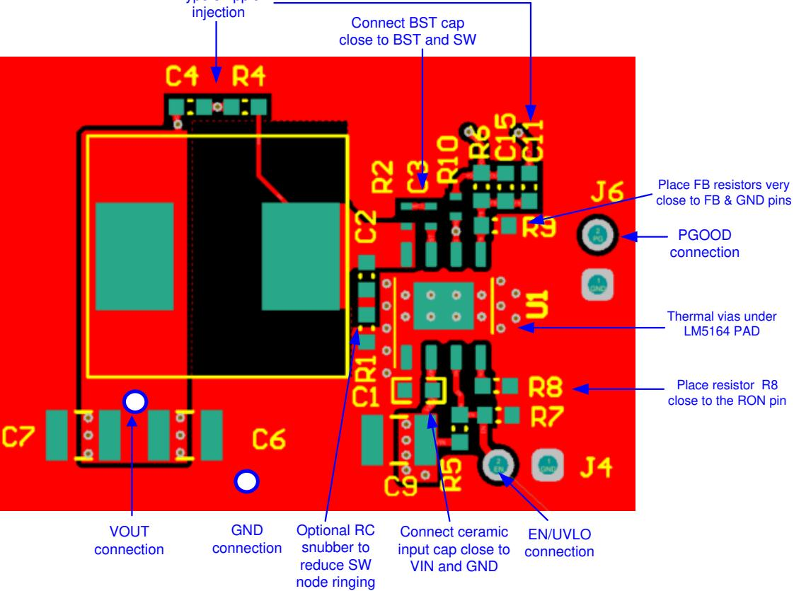

**Figure 7-19. LM5164 Single-Sided PCB Layout Example**

### **8 Device and Documentation Support 8.1 Device Support**

## *8.1.1 Third-Party Products Disclaimer*

TI'S PUBLICATION OF INFORMATION REGARDING THIRD-PARTY PRODUCTS OR SERVICES DOES NOT CONSTITUTE AN ENDORSEMENT REGARDING THE SUITABILITY OF SUCH PRODUCTS OR SERVICES OR A WARRANTY, REPRESENTATION OR ENDORSEMENT OF SUCH PRODUCTS OR SERVICES, EITHER ALONE OR IN COMBINATION WITH ANY TI PRODUCT OR SERVICE. *8.1.2 Development Support*

- *[LM5164 Quickstart Calculator](http://www.ti.com/tool/lm5163-lm5164design-calc)* • *[LM5164 Simulation Models](http://www.ti.com/product/LM5164/toolssoftware#simulationmodels)*
- *[TI Reference Design Library](http://www.ti.com/tidesigns)*
- Technical Articles:
  - *[Use a Low-quiescent-current Switcher for High-voltage Conversion](http://e2e.ti.com/blogs_/b/powerhouse/archive/2018/08/28/use-a-low-quiescent-current-switcher-for-high-voltage-conversion)* – *[Powering Smart Sensor Transmitters in Industrial Applications](https://e2e.ti.com/blogs_/b/industrial_strength/archive/2016/05/02/powering-smart-sensor-transmitters-in-industrial-applications)*
  - *[Industrial Strength Design Part 1](https://e2e.ti.com/blogs_/archives/b/energyzarr/archive/2013/04/29/industrial-strength-design-part-i)*
  - *[Trends in Building Automation: Predictive Maintenance](https://e2e.ti.com/blogs_/b/industrial_strength/archive/2016/11/01/trends-in-building-automation-predictive-maintenance)*
  - *[Trends in Building Automation: Connected Sensors for User Comfort](http://e2e.ti.com/blogs_/b/industrial_strength/archive/2016/09/02/trends-in-building-automation-connected-sensors-for-user-comfort)*

### **8.1.2.1 Custom Design With WEBENCH® Tools**

[Click here](https://webench.ti.com/wb5/WBTablet/PartDesigner/quickview.jsp?base_pn=LM5164&origin=ODS&litsection=device_support) to create a custom design using the LM5164 device with the WEBENCH® Power Designer.

- 1. Start by entering the input voltage (VIN), output voltage (VOUT), and output current (IOUT) requirements.
- 2. Optimize the design for key parameters such as efficiency, footprint, and cost using the optimizer dial.
- 3. Compare the generated design with other possible solutions from Texas Instruments.

The WEBENCH Power Designer provides a customized schematic along with a list of materials with real-time pricing and component availability.

In most cases, these actions are available:

- Run electrical simulations to see important waveforms and circuit performance
- Run thermal simulations to understand board thermal performance
- Export customized schematic and layout into popular CAD formats
- Print PDF reports for the design, and share the design with colleagues

Get more information about WEBENCH tools at [www.ti.com/WEBENCH.](http://www.ti.com/lsds/ti/analog/webench/overview.page?DCMP=sva_web_webdesigncntr_en&HQS=sva-web-webdesigncntr-vanity-lp-en)

### **8.2 Documentation Support**

### *8.2.1 Related Documentation*

For related documentation see the following:

- Texas Instruments, *[LM5164-Q1EVM-041 EVM](https://www.ti.com/lit/pdf/SNVU620)* user's guide
- Texas Instruments, *[Selecting an Ideal Ripple Generation Network for Your COT Buck Converter](https://www.ti.com/lit/pdf/SNVA776)* application
- [note](https://www.ti.com/lit/pdf/SNVA776) • Texas Instruments, *Valuing Wide VIN[, Low-EMI Synchronous Buck Circuits for Cost-Effective, Demanding](https://www.ti.com/lit/pdf/SLYY104) Applications* [white paper](https://www.ti.com/lit/pdf/SLYY104)
- Texas Instruments, *[An Overview of Conducted EMI Specifications for Power Supplies](https://www.ti.com/lit/pdf/SLYY136)* white paper
- Texas Instruments, *[An Overview of Radiated EMI Specifications for Power Supplies](https://www.ti.com/lit/pdf/SLYY142)* white paper
- Texas Instruments, *24-V AC Power Stage with Wide VIN [Converter and Battery Gauge for Smart Thermostat](https://www.ti.com/lit/pdf/TIDUCW0)*  [design guide](https://www.ti.com/lit/pdf/TIDUCW0)
- Texas Instruments, *[Accurate Gauging and 50-μA Standby Current, 13S, 48-V Li-ion Battery Pack Reference](https://www.ti.com/lit/pdf/TIDUEG7)*  [design guide](https://www.ti.com/lit/pdf/TIDUEG7)

Product Folder Links: *[LM5164](https://www.ti.com/product/lm5164?qgpn=lm5164)*

- • Texas Instruments, *[AN-2162: Simple Success with Conducted EMI from DC/DC Converters](https://www.ti.com/lit/pdf/SNVA489)* application note • Texas Instruments, *[Powering Drones with a Wide V](https://www.ti.com/lit/pdf/SNVA806)IN DC/DC Converter* application note
- Texas Instruments, *[Using New Thermal Metrics](https://www.ti.com/lit/pdf/SBVA025)* application note
- Texas Instruments, *[Semiconductor and IC Package Thermal Metrics](https://www.ti.com/lit/pdf/SPRA953)* application note
- **8.3 Receiving Notification of Documentation Updates**

To receive notification of documentation updates, navigate to the device product folder on [ti.com.](https://www.ti.com) Click on *Notifications* to register and receive a weekly digest of any product information that has changed. For change details, review the revision history included in any revised document. **8.4 Support Resources**

TI E2E™ [support forums](https://e2e.ti.com) are an engineer's go-to source for fast, verified answers and design help — straight from the experts. Search existing answers or ask your own question to get the quick design help you need.

Linked content is provided "AS IS" by the respective contributors. They do not constitute TI specifications and do not necessarily reflect TI's views; see TI's [Terms of Use.](https://www.ti.com/corp/docs/legal/termsofuse.shtml)

## **8.5 Trademarks**

PowerPAD™ and TI E2E™ are trademarks of Texas Instruments. WEBENCH® is a registered trademark of Texas Instruments.

All trademarks are the property of their respective owners.

### **8.6 Electrostatic Discharge Caution**

This integrated circuit can be damaged by ESD. Texas Instruments recommends that all integrated circuits be handled with appropriate precautions. Failure to observe proper handling and installation procedures can cause damage.

ESD damage can range from subtle performance degradation to complete device failure. Precision integrated circuits may be more susceptible to damage because very small parametric changes could cause the device not to meet its published specifications.

### **8.7 Glossary**

[TI Glossary](https://www.ti.com/lit/pdf/SLYZ022) This glossary lists and explains terms, acronyms, and definitions.

### **9 Revision History**

NOTE: Page numbers for previous revisions may differ from page numbers in the current version.

## **Changes from Revision C (April 2024) to Revision D (February 2026) Page**

• Added thermal pad size dimension recommended land pattern and stencil for devices from FMX A&T site (pages 28 – 30).................................................................................................................................................27

### **Changes from Revision B (August 2023) to Revision C (April 2024) Page** • Updated RϴJA, RϴJC(top), RϴJB, ΨJT, ΨJB, RϴJC(bot) thermal metrics.................................................................. [5](#page-4-0) • Corrected tON2 from 650ns to 1650ns................................................................................................................ [5](#page-4-0)

## **10 Mechanical, Packaging, and Orderable Information**

The following pages include mechanical packaging and orderable information. This information is the most current data available for the designated devices. This data is subject to change without notice and revision of this document. For browser-based versions of this data sheet, refer to the left-hand navigation.

# **DDA0008B PowerPAD SOIC - 1.7 mm max height**

### **PACKAGE OUTLINE** TM

PLASTIC SMALL OUTLINE

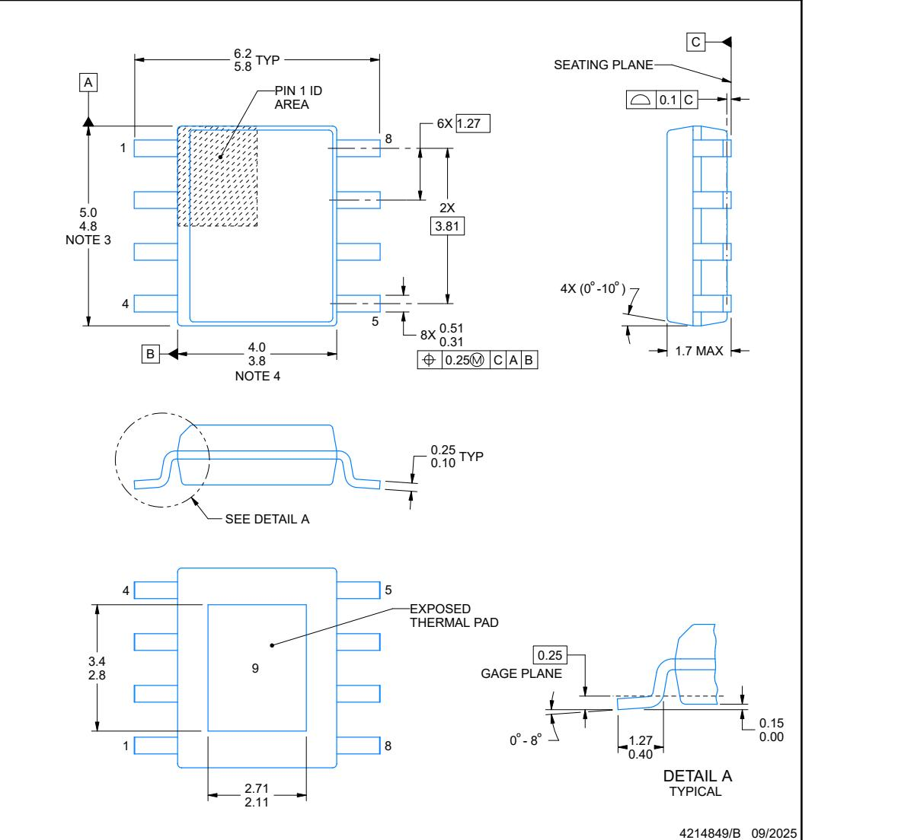

### NOTES:

PowerPAD is a trademark of Texas Instruments.

- 1. All linear dimensions are in millimeters. Any dimensions in parenthesis are for reference only. Dimensioning and tolerancing
  - per ASME Y14.5M.
- 2. This drawing is subject to change without notice. 3. This dimension does not include mold flash, protrusions, or gate burrs. Mold flash, protrusions, or gate burrs shall not
- exceed 0.15 mm perside. 4. This dimension does not include interlead flash. Interlead flash shall not exceed 0.25 mm per side.
- 5. Reference JEDEC registration MS-012.

### **EXAMPLE BOARD LAYOUT** TM

### **DDA0008B PowerPAD SOIC - 1.7 mm max height** PLASTIC SMALL OUTLINE

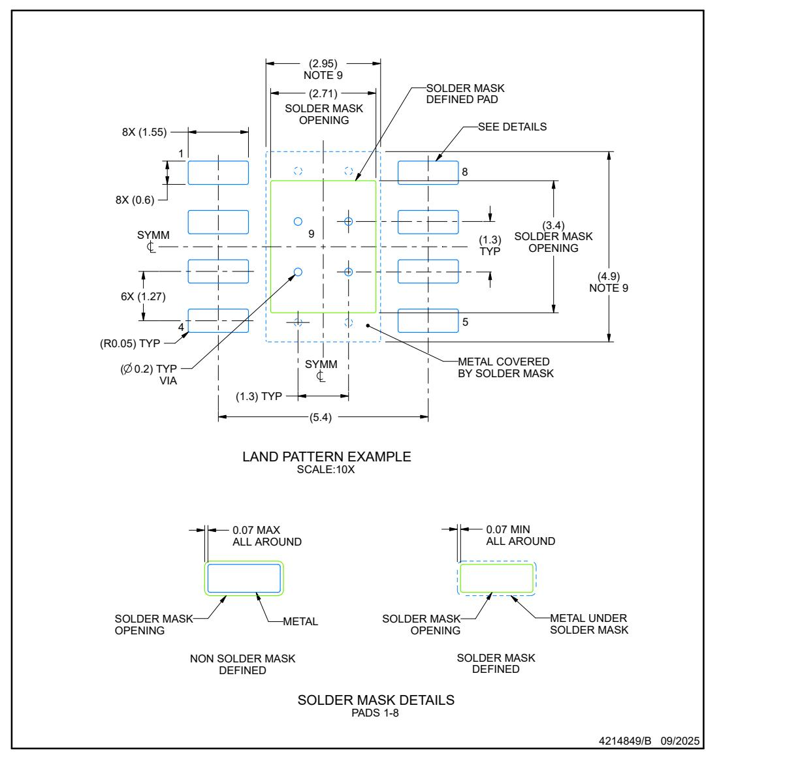

### NOTES: (continued)

- 6. Publication IPC-7351 may have alternate designs.
- 7. Solder mask tolerances between and around signal pads can vary based on board fabrication site. 8. This package isdesigned to be soldered to a thermalpad on the board. For more information, see Texas Instruments literature numbers SLMA002 (www.ti.com/lit/slma002) and SLMA004 (www.ti.com/lit/slma004).
- 9. Size of metal pad may vary due to creepage requirement. 10. Vias are optional depending on application, refer to device data sheet. If any vias are implemented, refer to their locations shown on this view. It is recommended that vias under paste be filled, plugged or tented.

### **EXAMPLE STENCIL DESIGN DDA0008B PowerPAD SOIC - 1.7 mm max height** TM

### PLASTIC SMALL OUTLINE

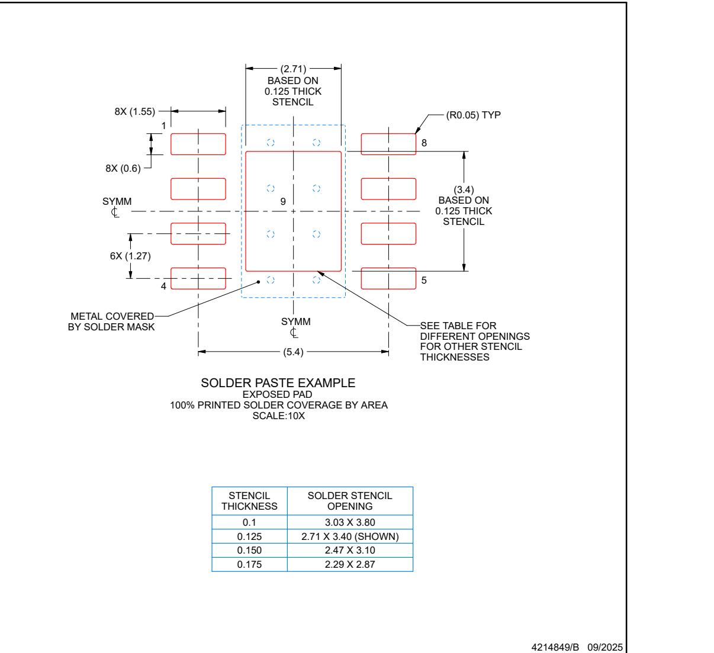

### NOTES: (continued)

- 11. Laser cutting apertures with trapezoidal walls and rounded corners may offer better paste release. IPC-7525 may have alternate design recommendations.
- 12. Board assembly site may have different recommendations for stencildesign.

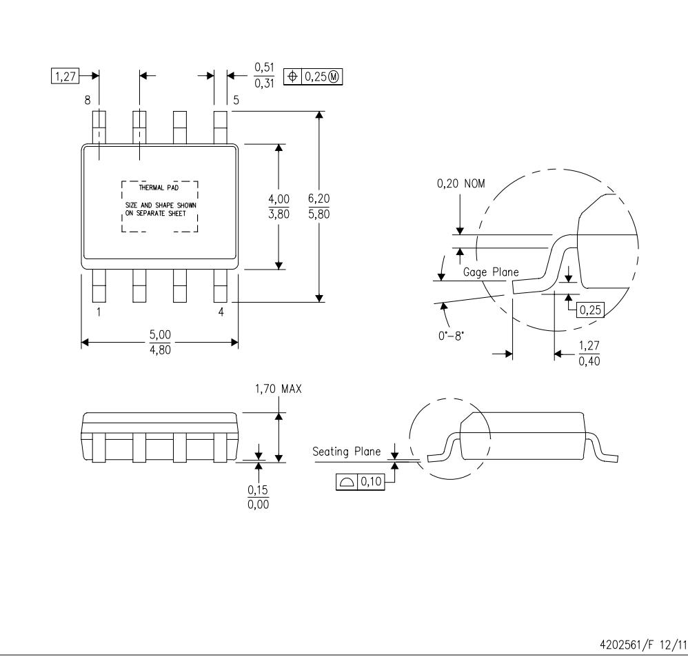

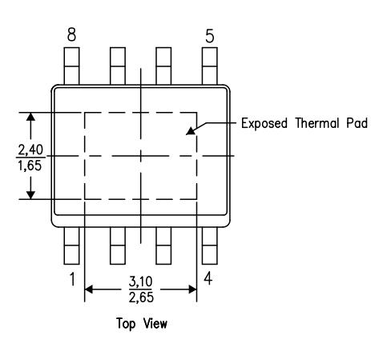

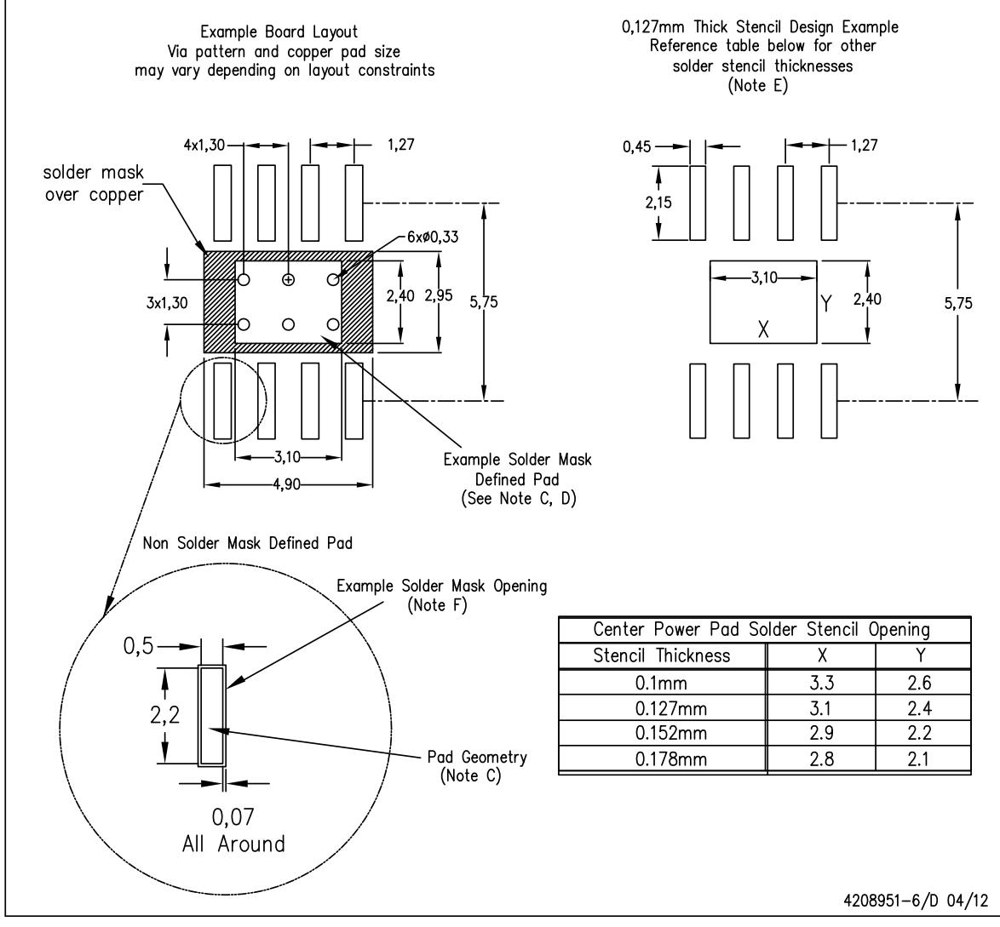

www.ti.com 11-Aug-2025

### **PACKAGING INFORMATION**

| Orderable part number | Status | Material type | Package   Pins           | Package qty   Carrier | RoHS | Lead finish/ Ball material | MSL rating/ Peak reflow | Op temp (°C) | Part marking |
|-----------------------|--------|---------------|--------------------------|-----------------------|------|-------------------------------|----------------------------|--------------|--------------|
|                       | (1)    | (2)           |                          |                       | (3)  | (4)                           | (5)                        |              | (6)          |
| LM5164DDAR            | Active | Production    | SO PowerPAD (DDA)   8 | 2500   LARGE T&R      | Yes  | NIPDAU   NIPDAUAG             | Level-2-260C-1 YEAR        | -40 to 150   | LM5164       |
| LM5164DDAR.A          | Active | Production    | SO PowerPAD (DDA)   8 | 2500   LARGE T&R      | Yes  | NIPDAU                        | Level-2-260C-1 YEAR        | -40 to 150   | LM5164       |
| LM5164DDARG4          | Active | Production    | SO PowerPAD (DDA)   8 | 2500   LARGE T&R      | Yes  | NIPDAU                        | Level-2-260C-1 YEAR        | -40 to 150   | LM5164       |
| LM5164DDARG4.A        | Active | Production    | SO PowerPAD (DDA)   8 | 2500   LARGE T&R      | Yes  | NIPDAU                        | Level-2-260C-1 YEAR        | -40 to 150   | LM5164       |
| LM5164DDAT            | Active | Production    | SO PowerPAD (DDA)   8 | 250   SMALL T&R       | Yes  | NIPDAU   NIPDAUAG             | Level-2-260C-1 YEAR        | -40 to 150   | LM5164       |
| LM5164DDAT.A          | Active | Production    | SO PowerPAD (DDA)   8 | 250   SMALL T&R       | Yes  | NIPDAU                        | Level-2-260C-1 YEAR        | -40 to 150   | LM5164       |

**(1) Status:** For more details on status, see our [product life cycle](https://www.ti.com/support-quality/quality-policies-procedures/product-life-cycle.html).

Multiple part markings will be inside parentheses. Only one part marking contained in parentheses and separated by a "~" will appear on a part. If a line is indented then it is a continuation of the previous line and the two combined represent the entire part marking for that device.

**(2) Material type:** When designated, preproduction parts are prototypes/experimental devices, and are not yet approved or released for full production. Testing and final process, including without limitation quality assurance, reliability performance testing, and/or process qualification, may not yet be complete, and this item is subject to further changes or possible discontinuation. If available for ordering, purchases will be subject to an additional waiver at checkout, and are intended for early internal evaluation purposes only. These items are sold without warranties of any kind.

**(3) RoHS values:** Yes, No, RoHS Exempt. See the [TI RoHS Statement](https://www.ti.com/lit/szzq088) for additional information and value definition.

**(4) Lead finish/Ball material:** Parts may have multiple material finish options. Finish options are separated by a vertical ruled line. Lead finish/Ball material values may wrap to two lines if the finish value exceeds the maximum column width.

**(5) MSL rating/Peak reflow:** The moisture sensitivity level ratings and peak solder (reflow) temperatures. In the event that a part has multiple moisture sensitivity ratings, only the lowest level per JEDEC standards is shown. Refer to the shipping label for the actual reflow temperature that will be used to mount the part to the printed circuit board.

**(6) Part marking:** There may be an additional marking, which relates to the logo, the lot trace code information, or the environmental category of the part.

www.ti.com 11-Aug-2025

**Important Information and Disclaimer:**The information provided on this page represents TI's knowledge and belief as of the date that it is provided. TI bases its knowledge and belief on information provided by third parties, and makes no representation or warranty as to the accuracy of such information. Efforts are underway to better integrate information from third parties. TI has taken and continues to take reasonable steps to provide representative and accurate information but may not have conducted destructive testing or chemical analysis on incoming materials and chemicals. TI and TI suppliers consider certain information to be proprietary, and thus CAS numbers and other limited information may not be available for release.

In no event shall TI's liability arising out of such information exceed the total purchase price of the TI part(s) at issue in this document sold by TI to Customer on an annual basis.

### **OTHER QUALIFIED VERSIONS OF LM5164 :**

Automotive : [LM5164-Q1](http://focus.ti.com/docs/prod/folders/print/lm5164-q1.html)

•

•

NOTE: Qualified Version Definitions:

Automotive - Q100 devices qualified for high-reliability automotive applications targeting zero defects

## **PACKAGE MATERIALS INFORMATION**

www.ti.com 11-Aug-2025

## **TAPE AND REEL INFORMATION**

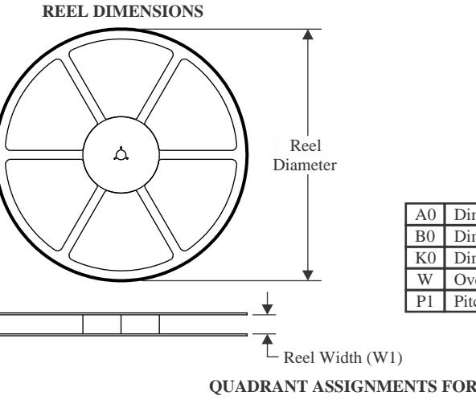

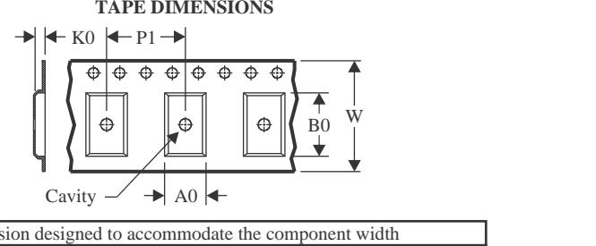

| A0 | Dimension designed to accommodate the component width     |
|----|-----------------------------------------------------------|
| B0 | Dimension designed to accommodate the component length    |
| K0 | Dimension designed to accommodate the component thickness |
| W  | Overall width of the carrier tape                         |
| P1 | Pitch between successive cavity centers                   |

### **QUADRANT ASSIGNMENTS FOR PIN 1 ORIENTATION IN TAPE**

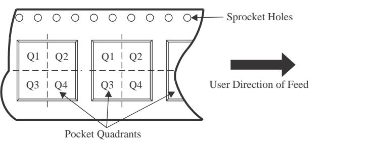

### \*All dimensions are nominal

| Device     | Package Type | Package Drawing | Pins | SPQ | Reel Diameter (mm) | Reel Width W1 (mm) | A0 (mm) | B0 (mm) | K0 (mm) | P1 (mm) | W (mm) | Pin1 Quadrant |
|------------|-----------------|--------------------|------|-----|--------------------------|--------------------------|------------|------------|------------|------------|-----------|------------------|
| LM5164DDAT | SO PowerPAD  | DDA                | 8    | 250 | 330.0                    | 12.8                     | 6.4        | 5.2        | 2.1        | 8.0        | 12.0      | Q1               |

## **PACKAGE MATERIALS INFORMATION**

www.ti.com 11-Aug-2025

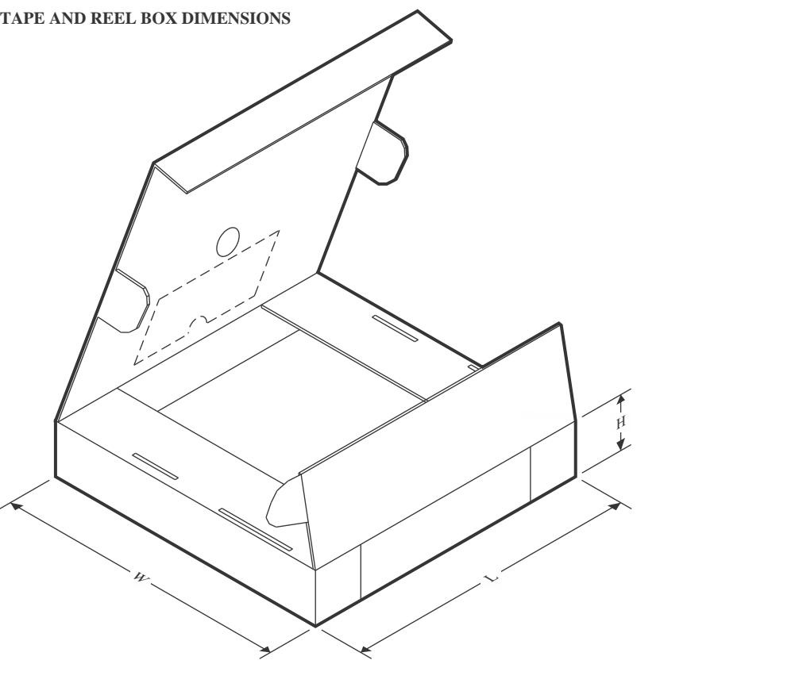

### \*All dimensions are nominal

| Device     | Package Type | Package Drawing | Pins | SPQ | Length (mm) | Width (mm) | Height (mm) |  |  |  |  |
|------------|--------------|-----------------|------|-----|-------------|------------|-------------|--|--|--|--|
| LM5164DDAT | SO PowerPAD  | DDA             | 8    | 250 | 366.0       | 364.0      | 50.0        |  |  |  |  |

## **IMPORTANT NOTICE AND DISCLAIMER**

TI PROVIDES TECHNICAL AND RELIABILITY DATA (INCLUDING DATASHEETS), DESIGN RESOURCES (INCLUDING REFERENCE DESIGNS), APPLICATION OR OTHER DESIGN ADVICE, WEB TOOLS, SAFETY INFORMATION, AND OTHER RESOURCES "AS IS" AND WITH ALL FAULTS, AND DISCLAIMS ALL WARRANTIES, EXPRESS AND IMPLIED, INCLUDING WITHOUT LIMITATION ANY IMPLIED WARRANTIES OF MERCHANTABILITY, FITNESS FOR A PARTICULAR PURPOSE OR NON-INFRINGEMENT OF THIRD PARTY INTELLECTUAL PROPERTY RIGHTS. These resources are intended for skilled developers designing with TI products. You are solely responsible for (1) selecting the appropriate

TI products for your application, (2) designing, validating and testing your application, and (3) ensuring your application meets applicable standards, and any other safety, security, regulatory or other requirements. These resources are subject to change without notice. TI grants you permission to use these resources only for development of an

application that uses the TI products described in the resource. Other reproduction and display of these resources is prohibited. No license is granted to any other TI intellectual property right or to any third party intellectual property right. TI disclaims responsibility for, and you fully indemnify TI and its representatives against any claims, damages, costs, losses, and liabilities arising out of your use of these resources. TI's products are provided subject to [TI's Terms of Sale](https://www.ti.com/legal/terms-conditions/terms-of-sale.html), [TI's General Quality Guidelines](https://www.ti.com/lit/pdf/SZZQ076), or other applicable terms available either on

[ti.com](https://www.ti.com) or provided in conjunction with such TI products. TI's provision of these resources does not expand or otherwise alter TI's applicable warranties or warranty disclaimers for TI products. Unless TI explicitly designates a product as custom or customer-specified, TI products are standard, catalog, general purpose devices. TI objects to and rejects any additional or different terms you may propose.

Copyright © 2026, Texas Instruments Incorporated Last updated 10/2025