**SGLS163B–APRIL 2003–REVISED NOVEMBER 2006**

## **ULTRALOW-NOISE, HIGH-PSRR, FAST RF 200-mA LOW-DROPOUT LINEAR REGULATORS**

### **FEATURES Controlled Baseline**

- **One Assembly/Test Site, One Fabrication Site Enhanced Diminishing Manufacturing Sources**
- **(DMS) Support Enhanced Product-Change Notification**
- **Qualification Pedigree** (1)
- **200-mA Low-Dropout Regulator With EN**
- **Available in 1.8 V, 2.5 V, 2.8 V, 2.85 V, 3 V,**
  - **3.3 V, 4.75 V, and Adjustable**
- **High PSRR (70 dB at 10 kHz)**
- **Ultralow Noise (32** µ**V)**
- **Fast Start-Up Time (50** µ**s)**
- **Stable With a 2.2-**µ**F Ceramic Capacitor**
- **Excellent Load/Line Transient**
- **Very Low Dropout Voltage** The TPS793xx family of low-dropout (LDO)
- **5-Pin SOT23 (DBV) Package**

#### **APPLICATIONS**

- **VCOs**

  - **, Wireless LAN**

(1) Component qualification in accordance with JEDEC and industry standards to ensure reliable operation over specified cycle, autoclave or unbiased HAST, electromigration, bond intermetallic life, and mold compound life. Such qualification testing should not be viewed as justifying use of this limits. time.

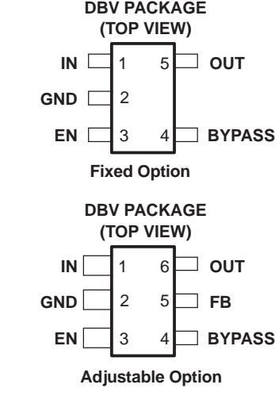

### **DESCRIPTION**

**(112 mV at Full Load, TPS79330)** low-power linear voltage regulators features high power-supply rejection ratio (PSRR), ultralow noise, fast start-up, and excellent line and load transient responses in a small-outline SOT23 package. Each device in the family is stable, with a small 2.2-µF ceramic capacitor on the output. The TPS793xx **RF** family uses an advanced, proprietary, BiCMOS **Bluetooth™** fabrication process to yield extremely low dropout voltages (e.g., 112 mV at 200 mA, TPS79330). Each device achieves fast start-up times (approximately 50 µs with a 0.001-µF bypass capacitor), while consuming very low quiescent current (170 µA typical). Moreover, when the device is placed in standby mode, the supply current is reduced to less than 1 µA. The TPS79328 exhibits approximately temperature range. This includes, but is not limited to, Highly 32 µVRMS of output voltage noise with a 0.1-µF Accelerated Stress Test (HAST) or biased 85/85, temperature bypass capacitor. Applications with analog components that are noise sensitive, such as portable RF electronics, benefit from the high PSRR component beyond specified performance and environmental and low-noise features, as well as the fast response

Bluetooth is a trademark of Bluetooth SIG, Inc.

Please be aware that an important notice concerning availability, standard warranty, and use in critical applications of Texas Instruments semiconductor products and disclaimers thereto appears at the end of this data sheet.

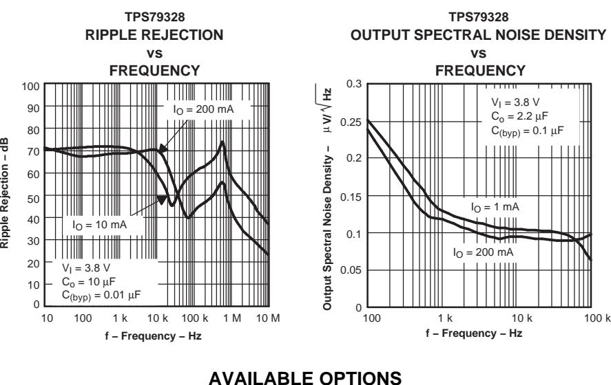

| TJ             | VOLTAGE      | PACKAGE        | PART NUMBER           | SYMBOL |
|----------------|--------------|----------------|-----------------------|--------|
|                | 1.2 to 5.5 V |                | TPS79301DBVREP(1)     | PGVE   |
|                | 1.8 V        |                | TPS79318DBVREP(1)     | PHHE   |
|                | 2.5 V        |                | TPS79325DBVREP(1)     | PGWE   |
|                | 2.8 V        |                | TPS79328DBVREP(1)(2)  | PGXE   |
| –40°C to 125°C | 2.85 V       | SOT23 (DBV) | TPS793285DBVREP(1)(2) | PHIE   |
|                | 3 V          |                | TPS79330DBVREP(1)(2)  | PGYE   |
|                | 3.3 V        |                | TPS793333DBVREP(1)    | PHUE   |
|                | 4.75 V       |                | TPS793475DBVREP(1)    | PHJE   |
| –55°C to 125°C | 1.2 to 5.5 V |                | TPS79301MDBVREP(1)    | PMBM   |

(1) The DBVR indicates tape and reel of 3000 parts.

(2) Product preview

**SGLS163B–APRIL 2003–REVISED NOVEMBER 2006**

### **ABSOLUTE MAXIMUM RATINGS(1)** over operating free-air temperature range (unless otherwise noted)

|                                   |                                              |                            | MIN | MAX | UNIT |  |
|-----------------------------------|----------------------------------------------|----------------------------|-----|-----|------|--|
|                                   | Input voltage range(2)                       |                            |     |     |      |  |
|                                   | Voltage range at EN                          |                            |     |     | V    |  |
| Voltage on OUT                    |                                              |                            |     |     | V    |  |
|                                   | Peak output current                          |                            |     |     |      |  |
|                                   |                                              | Human-Body Model (HBM)     |     | 2   | kV   |  |
| ESD rating                        |                                              | Changed-Device Model (CDM) |     | 500 | V    |  |
|                                   | Continuous total power dissipation           |                            |     |     |      |  |
| TJ                                | Operating virtual junction temperature range |                            |     |     |      |  |
| Storage temperature range Tstg |                                              |                            | –65 | 150 | °C   |  |

conditions" is not implied. Exposure to absolute-maximum-rated conditions for extended periods may affect device reliability. (2) All voltage values are with respect to network ground terminal

### **Dissipation Ratings**

| DERATING TA ≤ 25°C TA = 70°C TA = 85°C PACKAGE FACTOR ABOVE BOARD POWER POWER |                 |
|-------------------------------------------------------------------------------------------------------|-----------------|
| RθJC RθJA TA = 25°C RATING RATING                                                         | POWER RATING |
| Low K(1) DBV 63.75°C/W 256°C/W 3.906 mW/°C 391 mW 215 mW                            | 156 mW          |
| High K(2) DBV 63.75°C/W 178.3°C/W 5.609 mW/°C 561 mW 308 mW                         | 224 mW          |

(1) The JEDEC low K (1s) board design used to derive this data was a 3-in × 3-in, two layer board with 2-oz copper traces on top of the board.

(2) The JEDEC high K (2s2p) board design used to derive this data was a 3-in × 3-in, multilayer board with 1-oz internal power and ground planes and 2-oz copper traces on top and bottom of the board.

**SGLS163B–APRIL 2003–REVISED NOVEMBER 2006**

### **ELECTRICAL CHARACTERISTICS**

over recommended operating free-air temperature range, EN = VI , TJ = –55 to 125°C and TJ = –40 to 125°C, VI = VO(typ) + 1 V, I O = 1 mA, Co = 10 µF, C(byp) = 0.01 µF (unless otherwise noted) **PARAMETER TEST CONDITIONS MIN TYP MAX UNIT**

| PARAMETER                               |                                | TEST CONDITIONS                                |                     | MIN     | TYP         | MAX     | UNIT  |  |
|-----------------------------------------|--------------------------------|------------------------------------------------|---------------------|---------|-------------|---------|-------|--|
| Input voltage(1) VI                  |                                |                                                |                     | 2.7     |             | 5.5     | V     |  |
| IO Continuous output current         | (2)                            |                                                |                     | 0       |             | 200     | mA    |  |
| TJ                                      | Operating junction temperature |                                                |                     | –55     |             | 125     | °C    |  |
|                                         |                                | 0 µA < IO < 200 mA, 1.22 V ≤ VO ≤ 5.2 V (3) | TJ = –40 to 125°C,  | 0.98 Vo |             | 1.02 Vo |       |  |
|                                         | TPS79301                       | 0 µA < IO < 200 mA, 1.22 V ≤ VO ≤ 5.2 V (3) | TJ = –55 to 125°C,  |         | 1.025 Vo |         |       |  |
|                                         |                                | TJ = 25°C                                      |                     |         | 1.8         |         |       |  |
|                                         | TPS79318                       | 0 µA < IO < 200 mA,                            | 2.8 V < VI < 5.5 V  | 1.764   |             | 1.836   |       |  |
|                                         |                                | TJ = 25°C                                      |                     |         | 2.5         |         |       |  |
|                                         | TPS79325                       | 0 µA < IO < 200 mA,                            | 3.5 V < VI < 5.5 V  | 2.45    |             | 2.55    |       |  |
|                                         |                                | TJ = 25°C                                      |                     |         | 2.8         |         |       |  |
| Output voltage                          | TPS79328                       | 0 µA < I O < 200 mA,                        | 3.8 V < VI < 5.5 V  | 2.744   |             | 2.856   | V     |  |
|                                         |                                | TJ = 25°C                                      |                     |         | 2.85        |         |       |  |
|                                         | TPS793285                      | 0 µA < IO < 200 mA,                            | 3.85 V < VI < 5.5 V | 2.793   |             | 2.907   |       |  |
|                                         |                                | TJ = 25°C                                      |                     |         | 3           |         |       |  |
|                                         | TPS79330                       | 0 µA < IO < 200 mA,                            | 4 V < VI < 5.5 V    | 2.94    |             | 3.06    |       |  |
|                                         |                                | TJ = 25°C                                      |                     |         | 3.3         |         |       |  |
|                                         | TPS79333                       | 0 µA < IO < 200 mA,                            | 4.3 V < VI < 5.5 V  | 3.234   |             | 3.366   |       |  |
|                                         |                                | TJ = 25°C                                      |                     |         | 4.75        |         |       |  |
|                                         | TPS793475                      | 0 µA < IO < 200 mA,                            | 5.25 V < VI < 5.5 V | 4.655   |             | 4.845   |       |  |
|                                         |                                | 0 µA < IO < 200 mA,                            | TJ = 25°C           |         | 170         |         |       |  |
| Quiescent current (GND current)         |                                | 0 µA < IO < 200 mA                             |                     |         | 220         | µA      |       |  |
| Load regulation                         |                                | 0 µA < IO < 200 mA,                            | TJ = 25°C           |         | 5           |         | mV    |  |
|                                         | (4)                            | VO + 1 V < VI ≤ 5.5 V,                         | TJ = 25°C           |         | 0.05        |         |       |  |
| Output voltage line regulation (∆VO/VO) |                                | VO + 1 V < VI ≤ 5.5 V                          |                     |         |             | 0.12    | %/V   |  |
|                                         |                                |                                                | C(byp) = 0.001 µF   |         | 55          |         |       |  |
|                                         |                                | BW = 200 Hz to 100 kHz,                        | C(byp) = 0.0047 µF  | 36      |             |         |       |  |
| Output noise voltage (TPS79328)         |                                | IO = 200 mA, TJ = 25°C                         | C(byp) = 0.01 µF    |         | 33          |         | µVRMS |  |
|                                         |                                |                                                | C(byp) = 0.1 µF     |         | 32          |         |       |  |
| Time, start-up (TPS79328)               |                                |                                                | C(byp) = 0.001 µF   |         | 50          |         |       |  |
|                                         |                                | RL = 14 Ω, Co = 1 µF, TJ = 25°C             | C(byp) = 0.0047 µF  |         | 70          |         | µs    |  |
|                                         |                                |                                                | C(byp) = 0.01 µF    |         | 100         |         |       |  |
| Output current limit                    |                                |                                                |                     | 285     |             | 600     | mA    |  |
| Standby current                         |                                | EN = 0 V,                                      | 2.7 V < VI < 5.5 V  |         | 0.07        | 1       | µA    |  |
| High-level enable input voltage         |                                | 2.7 V < VI < 5.5 V                             |                     | 2       |             |         | V     |  |
| Low-level enable input voltage          |                                | 2.7 V < VI < 5.5 V                             |                     |         |             | 0.7     | V     |  |
| Input current (EN)                      |                                | EN = 0                                         |                     | –1      |             | 1       | µA    |  |
|                                         |                                |                                                |                     |         |             |         |       |  |

(1) To calculate the minimum input voltage for your maximum output current, use the following formula:

the device operate under conditions beyond those specified in this table for extended periods of time. (3) The minimum IN operating voltage is 2.7 V or VO(typ) + 1 V, whichever is greater. The maximum IN voltage is 5.5 V. The maximum

output current is 200 mA.   
(4) If 
$$V_O \le 2.5$$
 V, then  $V_{Imin} = 2.7$  V,  $V_{Imax} = 5.5$  V:

Line Reg. (mV) =  $(\%/V)$  ×  $\frac{V_O(V_{Imax} - 2.7 V)}{100}$  × 1000

If  $V_O \ge 2.5$  V, then  $V_{Imin} = V_O + 1$  V,  $V_{Imax} = 5.5$  V.

VI(min) = VO(max) + VDO (max load) (2) Continuous output current and operating junction temperature are limited by internal protection circuitry, but it is not recommended that

**SGLS163B–APRIL 2003–REVISED NOVEMBER 2006**

# **ELECTRICAL CHARACTERISTICS (continued)**

over recommended operating free-air temperature range, EN = VI , TJ = –55 to 125°C and TJ = –40 to 125°C, VI = VO(typ) + 1 V, IO = 1 mA, Co = 10 µF, C(byp) = 0.01 µF (unless otherwise noted)

| PARAMETER                     |           |                        | TEST CONDITIONS | MIN TYP | MAX  | UNIT |  |  |  |
|-------------------------------|-----------|------------------------|-----------------|------------|------|------|--|--|--|
| Input current (FB) (TPS79301) |           | FB = 1.8 V             |                 |            | 1    | µA   |  |  |  |
|                               |           | f = 100 Hz, TJ = 25°C, | IO = 10 mA      |            |      |      |  |  |  |
| Power-supply ripple           |           | f = 100 Hz, TJ = 25°C, | IO = 200 mA     | 68         |      |      |  |  |  |
| rejection                     | TPS79328  | f = 10 Hz, TJ = 25°C,  | IO = 200 mA     | 70         |      | dB   |  |  |  |
|                               |           | f = 100 Hz, TJ = 25°C, | IO = 200 mA     | 43         |      |      |  |  |  |
|                               |           | IO = 200 mA,           | TJ = 25°C       | 120        |      |      |  |  |  |
|                               | TPS79328  | IO = 200 mA            |                 |            | 200  |      |  |  |  |
|                               |           | IO = 200 mA,           | TJ= 25°C        | 120        |      |      |  |  |  |
|                               | TPS793285 | IO = 200 mA            |                 |            | 200  |      |  |  |  |
|                               |           | IO = 200 mA,           | TJ = 25°C       | 112        |      |      |  |  |  |
| Dropout voltage(5)            | TPS79330  | IO = 200 mA            |                 |            | 200  | mV   |  |  |  |
|                               |           | IO = 200 mA,           | TJ = 25°C       | 102        |      |      |  |  |  |
|                               | TPS79333  | IO = 200 mA            |                 |            | 180  |      |  |  |  |
|                               |           | IO = 200 mA,           | TJ = 25°C       | 77         |      |      |  |  |  |
|                               | TPS793475 | IO = 200 mA            |                 |            | 125  |      |  |  |  |
| UVLO threshold                |           | VCC rising             |                 | 2.25       | 2.65 | V    |  |  |  |
| UVLO hysteresis               |           | TJ = 25°C              | VCC rising      | 100        |      | mV   |  |  |  |
|                               |           |                        |                 |            |      |      |  |  |  |

(5) IN voltage equals VO(typ)– 100 mV; The TPS79325 dropout voltage is limited by the input voltage range limitations.

### **DEVICE INFORMATION**

### **FUNCTIONAL BLOCK DIAGRAM – ADJUSTABLE VERSION**

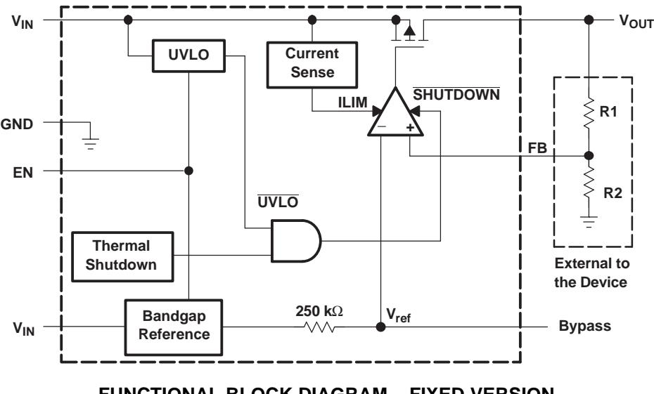

### **FUNCTIONAL BLOCK DIAGRAM – FIXED VERSION**

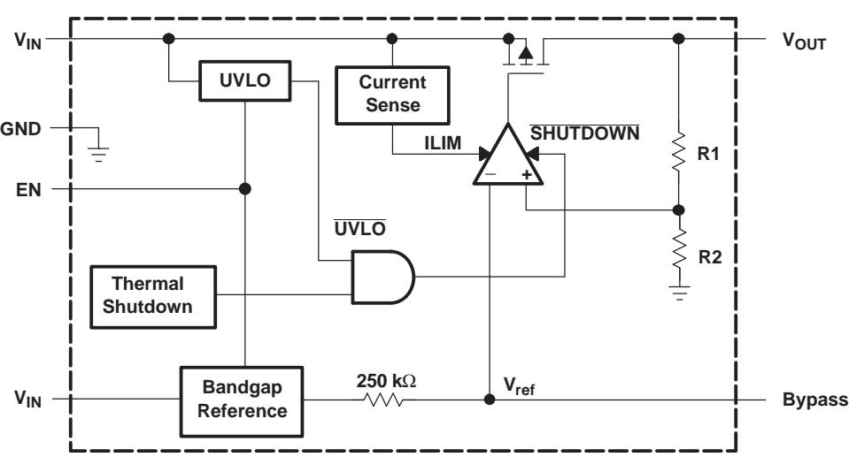

#### **TERMINAL FUNCTIONS**

| TERMINAL |     | I/O   | DESCRIPTION |                                                                                                                                                                                  |  |  |  |  |  |  |
|----------|-----|-------|-------------|----------------------------------------------------------------------------------------------------------------------------------------------------------------------------------|--|--|--|--|--|--|
| NAME     | ADJ | FIXED |             |                                                                                                                                                                                  |  |  |  |  |  |  |
| BYPASS   | 4   | 4     |             | An external bypass capacitor, connected to this terminal, in conjunction with an internal resistor, creates a low-pass filter to further reduce regulator noise.              |  |  |  |  |  |  |
| EN       | 3   | 3     | I           | Enable input that enables or shuts down the device. When EN goes to a logic high, the device is enabled. When the device goes to a logic low, the device is in shutdown mode. |  |  |  |  |  |  |
| FB       | 5   | N/A   | I           | Feedback input voltage for the adjustable device                                                                                                                                 |  |  |  |  |  |  |
| GND      | 2   | 2     |             | Regulator ground                                                                                                                                                                 |  |  |  |  |  |  |
| IN       | 1   | 1     | I           | Input to the device                                                                                                                                                              |  |  |  |  |  |  |
| OUT      | 6   | 5     | O           | Regulated output of the device                                                                                                                                                   |  |  |  |  |  |  |

## **TYPICAL CHARACTERISTICS**

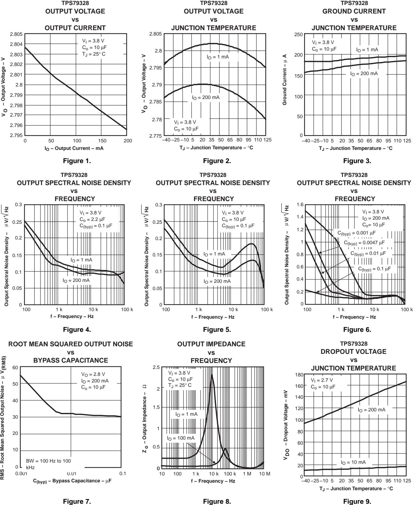

# **TYPICAL CHARACTERISTICS (continued)**

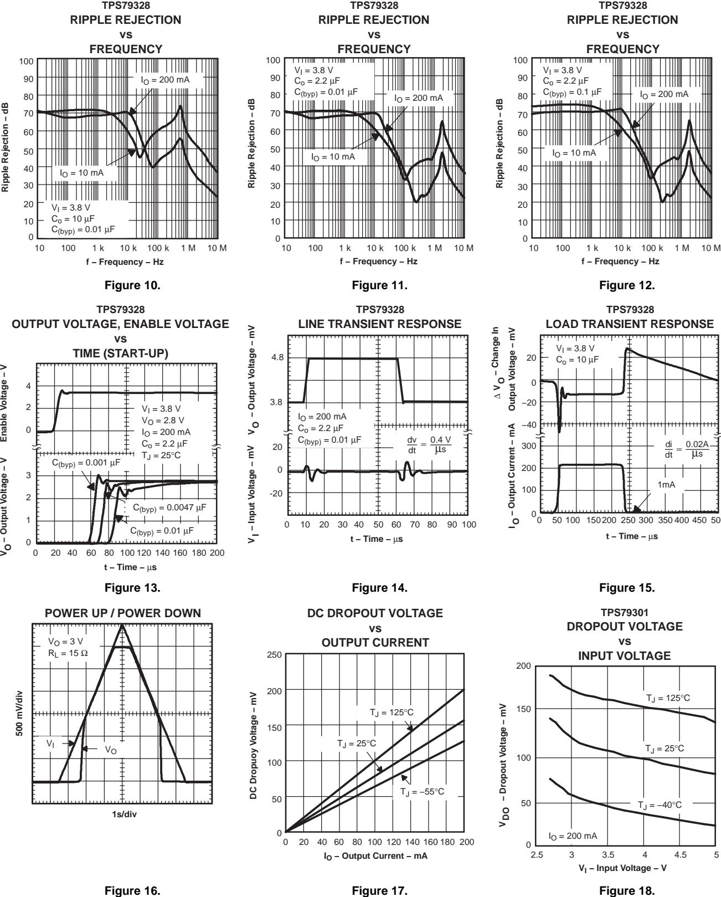

**SGLS163B–APRIL 2003–REVISED NOVEMBER 2006**

# **TYPICAL CHARACTERISTICS (continued)**

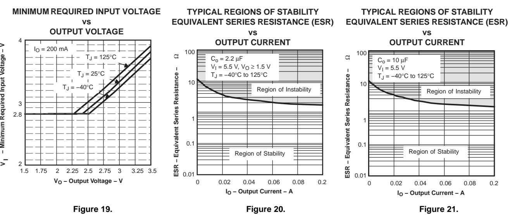

### **APPLICATION INFORMATION**

The TPS793xx family of low-dropout (LDO) regulators has been optimized for use in noise-sensitive battery-operated equipment. The device features extremely low dropout voltages, high PSRR, ultralow output noise, low quiescent current (170 µA typically), and enable-input to reduce supply currents to less than 1 µA when the regulator is turned off. A typical application circuit is shown in Figure 22.

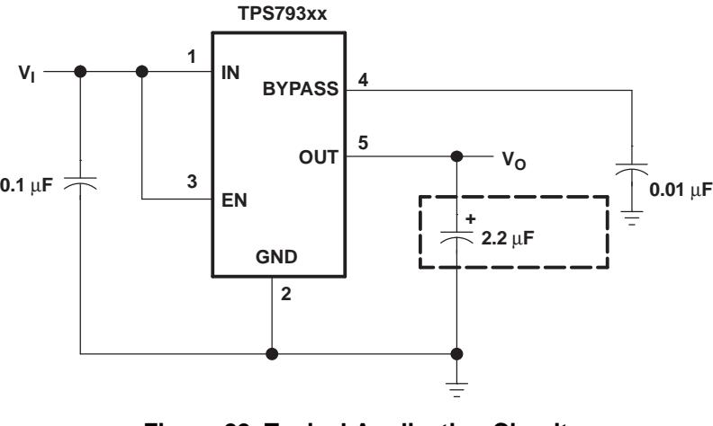

**Figure 22. Typical Application Circuit**

### **External Capacitor Requirements**

A 0.1-µF or larger ceramic input bypass capacitor, connected between IN and GND and located close to the TPS793xx, is required for stability and improves transient response, noise rejection, and ripple rejection. A higher-value electrolytic input capacitor may be necessary if large, fast-rise-time load transients are anticipated and the device is located several inches from the power source.

Like all LDOs, the TPS793xx requires an output capacitor connected between OUT and GND to stabilize the internal control loop. The minimum recommended capacitance is 2.2-µF. Any 2.2-µF or larger ceramic capacitor is suitable, provided the capacitance does not vary significantly over temperature.

The internal voltage reference is a key source of noise in an LDO regulator. The TPS793xx has a BYPASS pin that is connected to the voltage reference through a 250-kΩ internal resistor. The 250-kΩ internal resistor, in conjunction with an external bypass capacitor connected to the BYPASS pin, creates a low pass filter to reduce the voltage reference noise and, therefore, the noise at the regulator output. In order for the regulator to operate properly, the current flow out of the BYPASS pin must be at a minimum, because any leakage current creates an IR drop across the internal resistor, thus, creating an output error. Therefore, the bypass capacitor must have minimal leakage current.

For example, the TPS79328 exhibits only 32 µVRMS of output voltage noise using a 0.1-µF ceramic bypass capacitor and a 2.2-µF ceramic output capacitor. Note that the output starts up slower as the bypass capacitance increases due to the RC time constant at the BYPASS pin that is created by the internal 250-kΩ resistor and external capacitor.

### **Board Layout Recommendation to Improve PSRR and Noise Performance**

To improve ac measurements like PSRR, output noise, and transient response, it is recommended that the board be designed with separate ground planes for VIN and VOUT, with each ground plane connected only at the GND pin of the device. In addition, the ground connection for the bypass capacitor should connect directly to the GND pin of the device.

**SGLS163B–APRIL 2003–REVISED NOVEMBER 2006**

# **APPLICATION INFORMATION (continued)**

# **Power Dissipation and Junction Temperature**

Specified regulator operation is ensured to a junction temperature of 125°C; the maximum junction temperature should be restricted to 125°C under normal operating conditions. This restriction limits the power dissipation the regulator can handle in any given application. To ensure the junction temperature is within acceptable limits, calculate the maximum allowable dissipation, PD(max) , and the actual dissipation, PD, which must be less than or equal to PD(max) . The maximum power dissipation limit is determined using the following equation:

T max T

$$P_{D(max)} = \frac{I_J^{max} - I_A}{R_{\theta JA}}$$
Where:

TJmax = Maximum allowable junction temperature Rθ

JA = Thermal resistance, junction to ambient, for the package, see the dissipation rating table TA = Ambient temperature

The regulator dissipation is calculated using:

$$P_{D} = (V_{I} - V_{O}) \times I_{O}$$
(2)

Power dissipation resulting from quiescent current is negligible. Excessive power dissipation triggers the thermal protection circuit.

### **Programming the TPS79301 Adjustable LDO Regulator**

The output voltage of the TPS79301 adjustable regulator is programmed using an external resistor divider as shown in [Figure](#page-11-0) 23. The output voltage is calculated using:

$$V_{O} = V_{ref} \times \left(1 + \frac{R1}{R2}\right) \tag{3}$$

Where:

Vref = 1.2246 V typical (the internal reference voltage)

**SGLS163B–APRIL 2003–REVISED NOVEMBER 2006**

# **APPLICATION INFORMATION (continued)**

# **Programming the TPS79301 Adjustable LDO Regulator (continued)**

VO Resistors R1 and R2 should be chosen for approximately 50-µA divider current. Lower-value resistors can be used for improved noise performance, but the solution consumes more power. Higher resistor values should be avoided as leakage current into/out of FB across R1/R2 creates an offset voltage that artificially increases/decreases the feedback voltage and, thus, erroneously decreases/increases VO. The recommended design procedure is to choose R2 = 30.1 kΩ to set the divider current at 50 µA, C1 = 15 pF for stability, and then calculate R1 using:

$$R1 = \left(\frac{V_O}{V_{ref}} - 1\right) \times R2$$
(4)

Where to improve the stability of the adjustable version, it is suggested that a small compensation capacitor be

(3 x 10–7) x (R1 R2) In order to improve the stability of the adjustable version, it is suggested that a small compensation capacitor be placed between OUT and FB. For voltages <1.8 V, the value of this capacitor should be 100 pF. For voltages >1.8 V, the approximate value of this capacitor can be calculated as:

$$C1 = \frac{(3 \times 10^{-7}) \times (K1^{-7} + K2)}{(R1 \times R2)}$$
(5)

The suggested value of this capacitor for several resistor ratios is shown in the table below. If this capacitor is not used (such as in a unity-gain configuration) or if an output voltage <1.8 V is chosen, then the minimum recommended output capacitor is 4.7 µF instead of 2.2 µF.

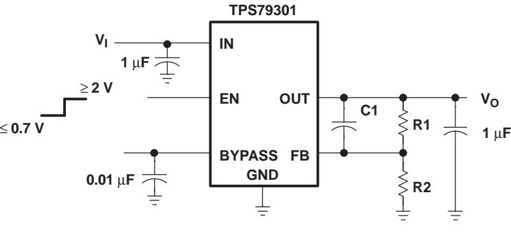

### **OUTPUT VOLTAGE PROGRAMMING GUIDE**

| OUTPUT VOLTAGE | R1      | R2      | C1    |
|-------------------|---------|---------|-------|
| 2.5 V             | 31.6 kΩ | 30.1 kΩ | 22 pF |
| 3.3 V             | 51 kΩ   | 30.1 kΩ | 15 pF |
| 3.6 V             | 59 kΩ   | 30.1 kΩ | 15 pF |
|                   |         |         |       |

**Figure 23. TPS79301 Adjustable LDO Regulator Programming**

#### **Regulator Protection**

The TPS793xx features internal current limiting and thermal protection. During normal operation, the TPS793xx limits output current to approximately 400 mA. When current limiting engages, the output voltage scales back linearly until the overcurrent condition ends. While current limiting is designed to prevent gross device failure, care should be taken not to exceed the power dissipation ratings of the package or the absolute maximum voltage ratings of the device. If the temperature of the device exceeds approximately 165°C, thermal-protection circuitry shuts it down. Once the device has cooled down to below approximately 140°C, regulator operation resumes.

www.ti.com 11-Nov-2025

### **PACKAGING INFORMATION**

| Orderable part number | Status | Material type | Package   Pins   | Package qty   Carrier | RoHS | Lead finish/ Ball material | MSL rating/ Peak reflow | Op temp (°C) | Part marking |
|-----------------------|--------|---------------|------------------|-----------------------|------|-------------------------------|----------------------------|--------------|--------------|
|                       | (1)    | (2)           |                  |                       | (3)  | (4)                           | (5)                        |              | (6)          |
| TPS79301DBVREP        | Active | Production    | SOT-23 (DBV)   6 | 3000   LARGE T&R      | Yes  | NIPDAU                        | Level-1-260C-UNLIM         | -40 to 125   | PGVE         |
| TPS79301DBVREP.A      | Active | Production    | SOT-23 (DBV)   6 | 3000   LARGE T&R      | Yes  | NIPDAU                        | Level-1-260C-UNLIM         | -40 to 125   | PGVE         |
| TPS79301MDBVREP       | Active | Production    | SOT-23 (DBV)   6 | 3000   LARGE T&R      | Yes  | NIPDAU                        | Level-1-260C-UNLIM         | -40 to 125   | PMBM         |
| TPS79301MDBVREP.A     | Active | Production    | SOT-23 (DBV)   6 | 3000   LARGE T&R      | Yes  | NIPDAU                        | Level-1-260C-UNLIM         | -40 to 125   | PMBM         |
| TPS79318DBVREP        | Active | Production    | SOT-23 (DBV)   5 | 3000   LARGE T&R      | Yes  | NIPDAU                        | Level-1-260C-UNLIM         | -40 to 125   | PHHE         |
| TPS79318DBVREP.A      | Active | Production    | SOT-23 (DBV)   5 | 3000   LARGE T&R      | Yes  | NIPDAU                        | Level-1-260C-UNLIM         | -40 to 125   | PHHE         |
| TPS79333DBVREP        | Active | Production    | SOT-23 (DBV)   5 | 3000   LARGE T&R      | Yes  | NIPDAU                        | Level-1-260C-UNLIM         | -40 to 125   | PHUE         |
| TPS79333DBVREP.A      | Active | Production    | SOT-23 (DBV)   5 | 3000   LARGE T&R      | Yes  | NIPDAU                        | Level-1-260C-UNLIM         | -40 to 125   | PHUE         |
| TPS793475DBVREP       | Active | Production    | SOT-23 (DBV)   5 | 3000   LARGE T&R      | Yes  | NIPDAU                        | Level-1-260C-UNLIM         | -40 to 125   | PHJE         |
| TPS793475DBVREP.A     | Active | Production    | SOT-23 (DBV)   5 | 3000   LARGE T&R      | Yes  | NIPDAU                        | Level-1-260C-UNLIM         | -40 to 125   | PHJE         |
| V62/03634-01YE        | Active | Production    | SOT-23 (DBV)   6 | 3000   LARGE T&R      | Yes  | NIPDAU                        | Level-1-260C-UNLIM         | -40 to 125   | PGVE         |
| V62/03634-02XE        | Active | Production    | SOT-23 (DBV)   5 | 3000   LARGE T&R      | Yes  | NIPDAU                        | Level-1-260C-UNLIM         | -40 to 125   | PHHE         |
| V62/03634-07XE        | Active | Production    | SOT-23 (DBV)   5 | 3000   LARGE T&R      | Yes  | NIPDAU                        | Level-1-260C-UNLIM         | -40 to 125   | PHUE         |
| V62/03634-08XE        | Active | Production    | SOT-23 (DBV)   5 | 3000   LARGE T&R      | Yes  | NIPDAU                        | Level-1-260C-UNLIM         | -40 to 125   | PHJE         |
| V62/03634-09XE        | Active | Production    | SOT-23 (DBV)   6 | 3000   LARGE T&R      | Yes  | NIPDAU                        | Level-1-260C-UNLIM         | -40 to 125   | PMBM         |

**(1) Status:** For more details on status, see our [product life cycle](https://www.ti.com/support-quality/quality-policies-procedures/product-life-cycle.html).

**(2) Material type:** When designated, preproduction parts are prototypes/experimental devices, and are not yet approved or released for full production. Testing and final process, including without limitation quality assurance, reliability performance testing, and/or process qualification, may not yet be complete, and this item is subject to further changes or possible discontinuation. If available for ordering, purchases will be subject to an additional waiver at checkout, and are intended for early internal evaluation purposes only. These items are sold without warranties of any kind.

**(3) RoHS values:** Yes, No, RoHS Exempt. See the [TI RoHS Statement](https://www.ti.com/lit/szzq088) for additional information and value definition.

**(4) Lead finish/Ball material:** Parts may have multiple material finish options. Finish options are separated by a vertical ruled line. Lead finish/Ball material values may wrap to two lines if the finish value exceeds the maximum column width.

**(5) MSL rating/Peak reflow:** The moisture sensitivity level ratings and peak solder (reflow) temperatures. In the event that a part has multiple moisture sensitivity ratings, only the lowest level per JEDEC standards is shown. Refer to the shipping label for the actual reflow temperature that will be used to mount the part to the printed circuit board.

**(6) Part marking:** There may be an additional marking, which relates to the logo, the lot trace code information, or the environmental category of the part.

### **PACKAGE OPTION ADDENDUM**

www.ti.com 11-Nov-2025

Multiple part markings will be inside parentheses. Only one part marking contained in parentheses and separated by a "~" will appear on a part. If a line is indented then it is a continuation of the previous line and the two combined represent the entire part marking for that device.

**Important Information and Disclaimer:**The information provided on this page represents TI's knowledge and belief as of the date that it is provided. TI bases its knowledge and belief on information provided by third parties, and makes no representation or warranty as to the accuracy of such information. Efforts are underway to better integrate information from third parties. TI has taken and continues to take reasonable steps to provide representative and accurate information but may not have conducted destructive testing or chemical analysis on incoming materials and chemicals. TI and TI suppliers consider certain information to be proprietary, and thus CAS numbers and other limited information may not be available for release.

In no event shall TI's liability arising out of such information exceed the total purchase price of the TI part(s) at issue in this document sold by TI to Customer on an annual basis.

# **PACKAGE MATERIALS INFORMATION**

www.ti.com 5-Jan-2021

### **TAPE AND REEL INFORMATION**

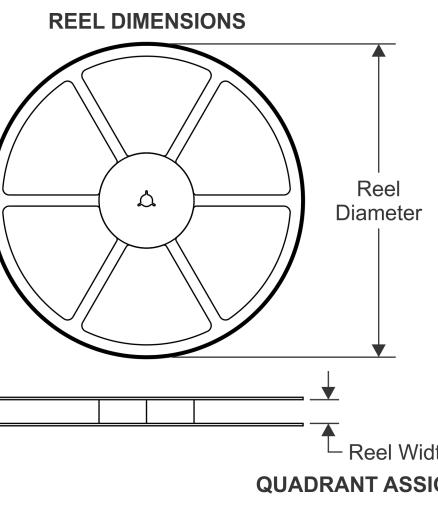

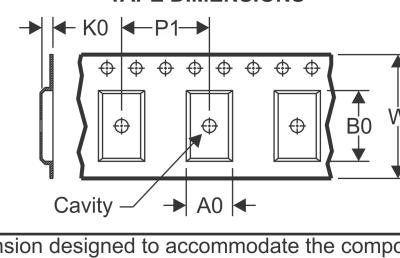

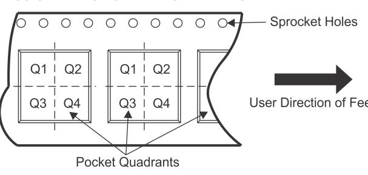

#### \*All dimensions are nominal

| *All dimensions are nominal |                 |                    |      |      |                          |                          |            |            |            |            |           |                  |
|-----------------------------|-----------------|--------------------|------|------|--------------------------|--------------------------|------------|------------|------------|------------|-----------|------------------|
| Device                      | Package Type | Package Drawing | Pins | SPQ  | Reel Diameter (mm) | Reel Width W1 (mm) | A0 (mm) | B0 (mm) | K0 (mm) | P1 (mm) | W (mm) | Pin1 Quadrant |
| TPS79301DBVREP              | SOT-23          | DBV                | 6    | 3000 | 180.0                    | 9.0                      | 3.15       | 3.2        | 1.4        | 4.0        | 8.0       | Q3               |
| TPS79301MDBVREP             | SOT-23          | DBV                | 6    | 3000 | 179.0                    | 8.4                      | 3.2        | 3.2        | 1.4        | 4.0        | 8.0       | Q3               |
| TPS79318DBVREP              | SOT-23          | DBV                | 5    | 3000 | 180.0                    | 9.0                      | 3.15       | 3.2        | 1.4        | 4.0        | 8.0       | Q3               |
| TPS79333DBVREP              | SOT-23          | DBV                | 5    | 3000 | 180.0                    | 9.0                      | 3.15       | 3.2        | 1.4        | 4.0        | 8.0       | Q3               |
| TPS793475DBVREP             | SOT-23          | DBV                | 5    | 3000 | 180.0                    | 9.0                      | 3.15       | 3.2        | 1.4        | 4.0        | 8.0       | Q3               |

www.ti.com 5-Jan-2021

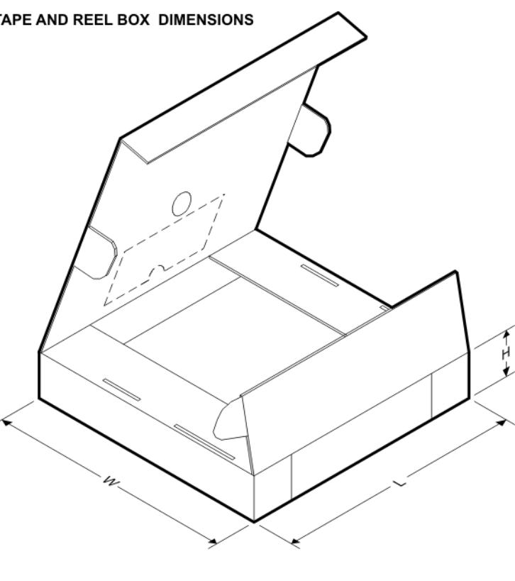

\*All dimensions are nominal

| Device          | Package Type | Package Drawing | Pins | SPQ  | Length (mm) | Width (mm) | Height (mm) |
|-----------------|--------------|-----------------|------|------|-------------|------------|-------------|
| TPS79301DBVREP  | SOT-23       | DBV             | 6    | 3000 | 182.0       | 182.0      | 20.0        |
| TPS79301MDBVREP | SOT-23       | DBV             | 6    | 3000 | 200.0       | 183.0      | 25.0        |
| TPS79318DBVREP  | SOT-23       | DBV             | 5    | 3000 | 182.0       | 182.0      | 20.0        |
| TPS79333DBVREP  | SOT-23       | DBV             | 5    | 3000 | 182.0       | 182.0      | 20.0        |
| TPS793475DBVREP | SOT-23       | DBV             | 5    | 3000 | 182.0       | 182.0      | 20.0        |

SMALL OUTLINE TRANSISTOR

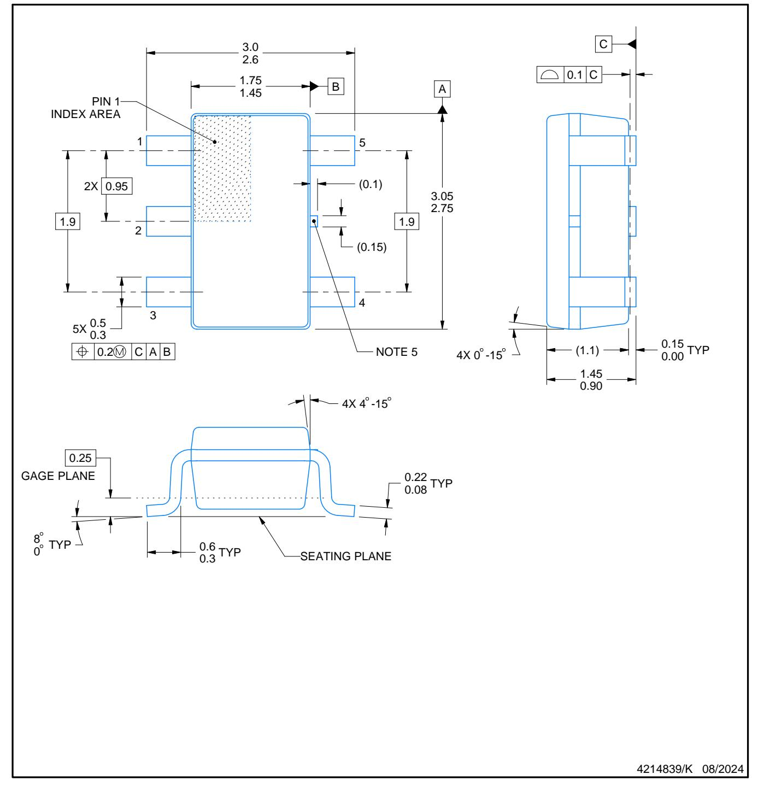

### NOTES:

- 1. All linear dimensions are in millimeters. Any dimensions in parenthesis are for reference only. Dimensioning and tolerancing per ASME Y14.5M.
- 2. This drawing is subject to change without notice.
- 3. Refernce JEDEC MO-178.
- 4. Body dimensions do not include mold flash, protrusions, or gate burrs. Mold flash, protrusions, or gate burrs shall not exceed 0.25 mm per side.
- 5. Support pin may differ or may not be present.

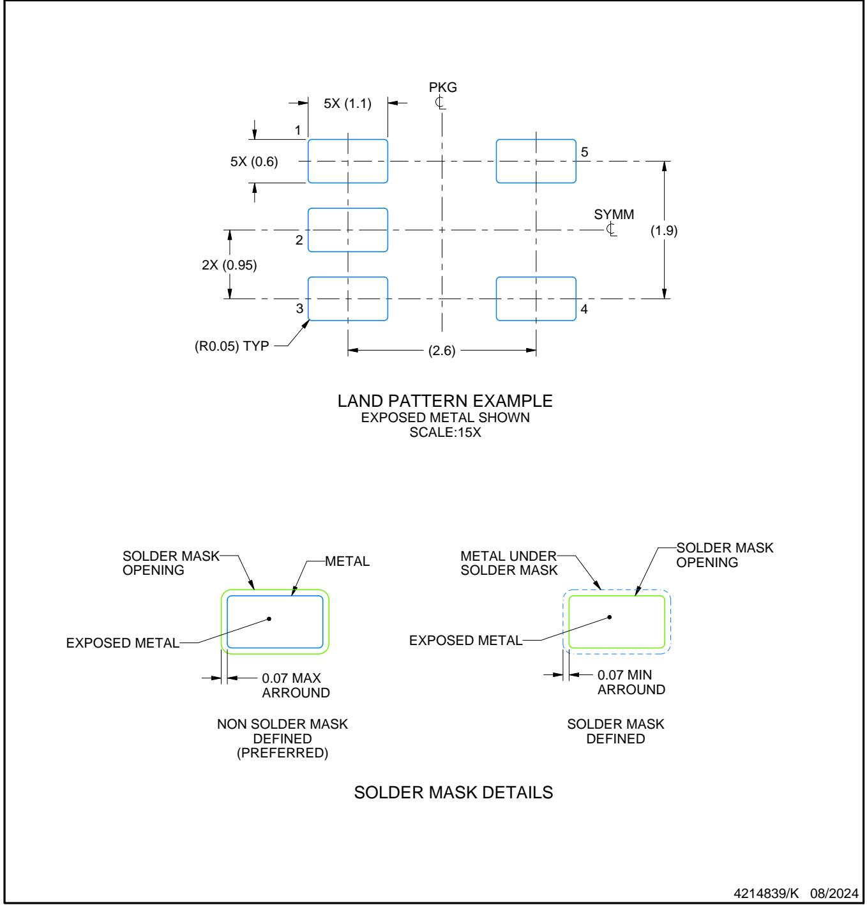

NOTES: (continued)

- 6. Publication IPC-7351 may have alternate designs.
- 7. Solder mask tolerances between and around signal pads can vary based on board fabrication site.

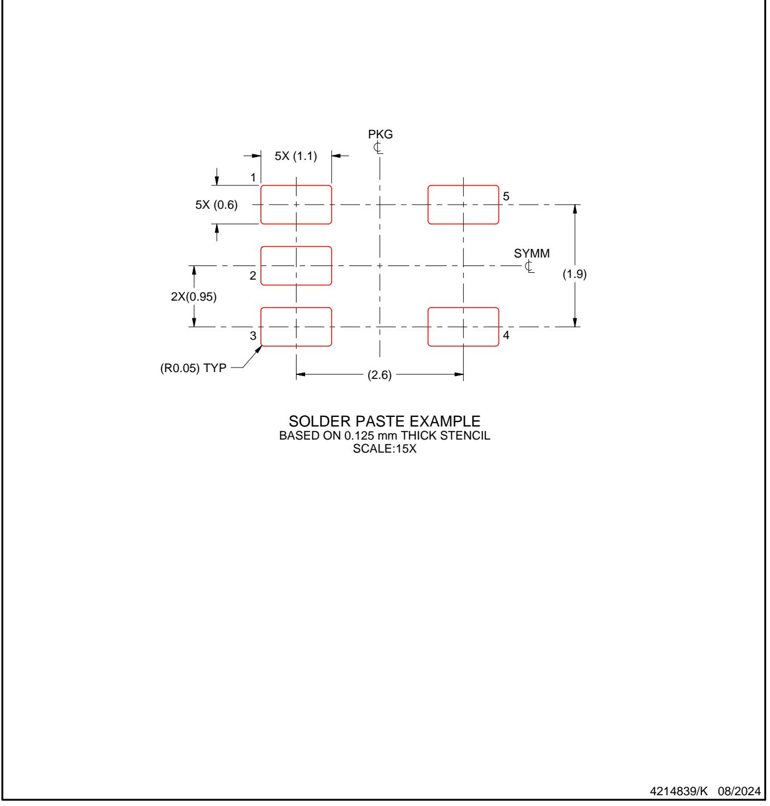

NOTES: (continued)

- 8. Laser cutting apertures with trapezoidal walls and rounded corners may offer better paste release. IPC-7525 may have alternate design recommendations.
- 9. Board assembly site may have different recommendations for stencil design.

### **DBV0006A SOT-23 - 1.45 mm max height** SMALL OUTLINE TRANSISTOR

C 0.22 0.08 TYP 0.25 3.0 2.6 2X 0.95 1.45 0.90 0.15 0.00 TYP 6X 0.50 0.25 0.6 0.3 TYP 8 0 TYP 1.9 4X 0 -15 4X 4 -15 A 3.05 2.75 B 1.75 1.45 (1.1) 4214840/G 08/2024 0.2 C A B 1 3 4 5 2 INDEX AREA PIN 1 6 GAGE PLANE SEATING PLANE 0.1 C

### NOTES:

- 1. All linear dimensions are in millimeters. Any dimensions in parenthesis are for reference only. Dimensioning and tolerancing per ASME Y14.5M.
- 2. This drawing is subject to change without notice.
- 3. Body dimensions do not include mold flash or protrusion. Mold flash and protrusion shall not exceed 0.25 per side.
- 4. Leads 1,2,3 may be wider than leads 4,5,6 for package orientation.
- 5. Refernce JEDEC MO-178.

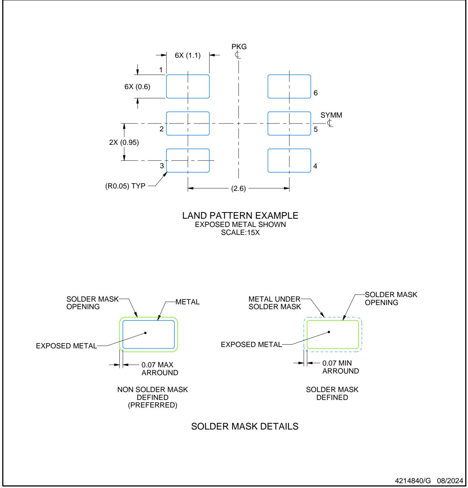

NOTES: (continued)

- 6. Publication IPC-7351 may have alternate designs.
- 7. Solder mask tolerances between and around signal pads can vary based on board fabrication site.

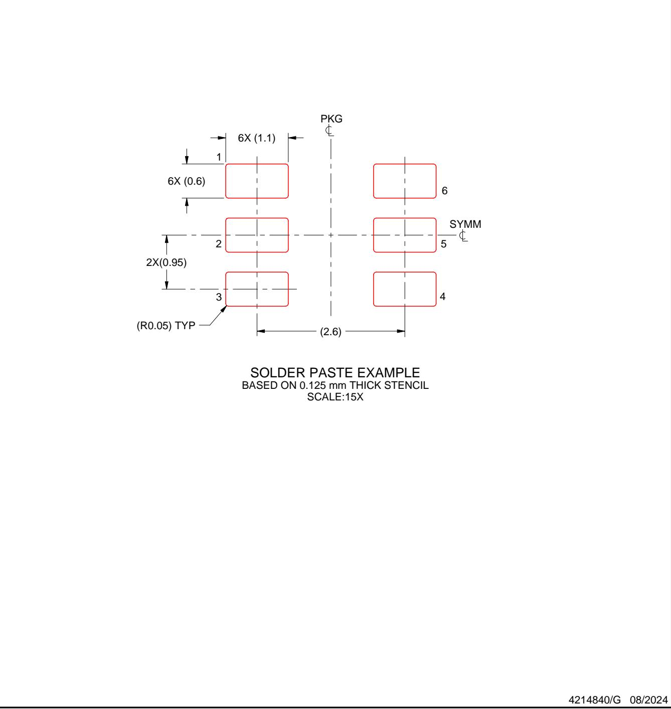

NOTES: (continued)

- 8. Laser cutting apertures with trapezoidal walls and rounded corners may offer better paste release. IPC-7525 may have alternate design recommendations.
- 9. Board assembly site may have different recommendations for stencil design.

# **IMPORTANT NOTICE AND DISCLAIMER**

TI PROVIDES TECHNICAL AND RELIABILITY DATA (INCLUDING DATASHEETS), DESIGN RESOURCES (INCLUDING REFERENCE DESIGNS), APPLICATION OR OTHER DESIGN ADVICE, WEB TOOLS, SAFETY INFORMATION, AND OTHER RESOURCES "AS IS" AND WITH ALL FAULTS, AND DISCLAIMS ALL WARRANTIES, EXPRESS AND IMPLIED, INCLUDING WITHOUT LIMITATION ANY IMPLIED WARRANTIES OF MERCHANTABILITY, FITNESS FOR A PARTICULAR PURPOSE OR NON-INFRINGEMENT OF THIRD PARTY INTELLECTUAL PROPERTY RIGHTS. These resources are intended for skilled developers designing with TI products. You are solely responsible for (1) selecting the appropriate

TI products for your application, (2) designing, validating and testing your application, and (3) ensuring your application meets applicable standards, and any other safety, security, regulatory or other requirements. These resources are subject to change without notice. TI grants you permission to use these resources only for development of an

application that uses the TI products described in the resource. Other reproduction and display of these resources is prohibited. No license is granted to any other TI intellectual property right or to any third party intellectual property right. TI disclaims responsibility for, and you fully indemnify TI and its representatives against any claims, damages, costs, losses, and liabilities arising out of your use of these resources. TI's products are provided subject to [TI's Terms of Sale,](https://www.ti.com/legal/terms-conditions/terms-of-sale.html) [TI's General Quality Guidelines,](https://www.ti.com/lit/pdf/SZZQ076) or other applicable terms available either on

[ti.com](https://www.ti.com) or provided in conjunction with such TI products. TI's provision of these resources does not expand or otherwise alter TI's applicable warranties or warranty disclaimers for TI products. Unless TI explicitly designates a product as custom or customer-specified, TI products are standard, catalog, general purpose devices. TI objects to and rejects any additional or different terms you may propose.

Copyright © 2025, Texas Instruments Incorporated Last updated 10/2025